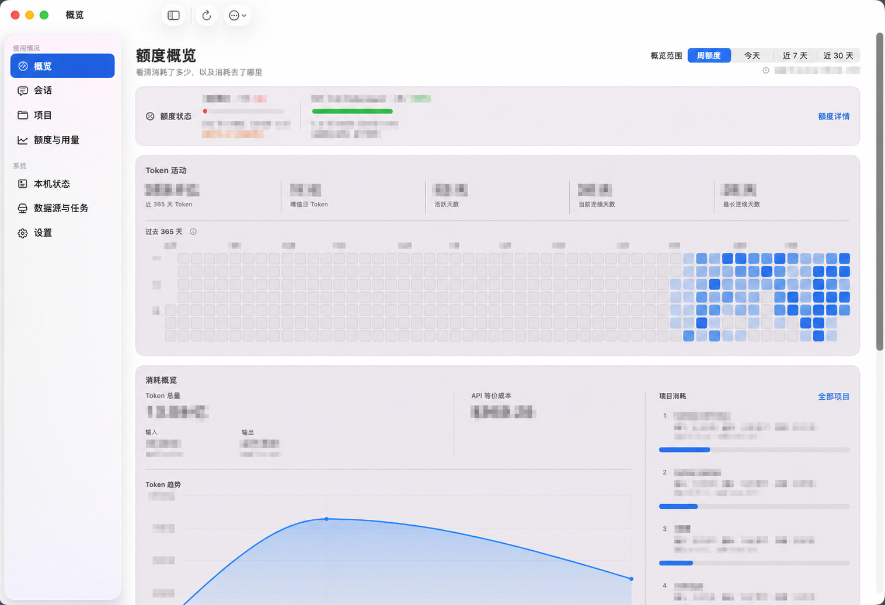
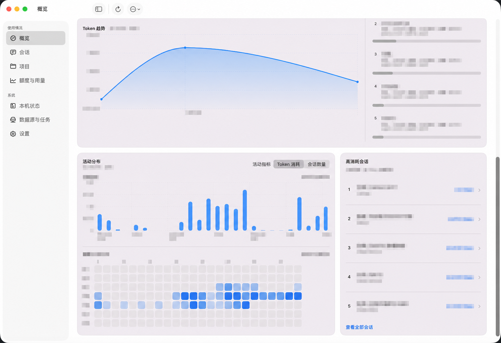
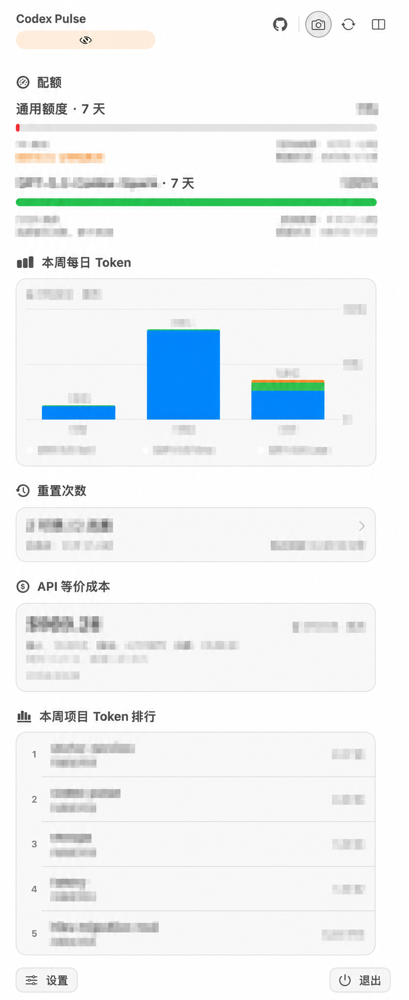
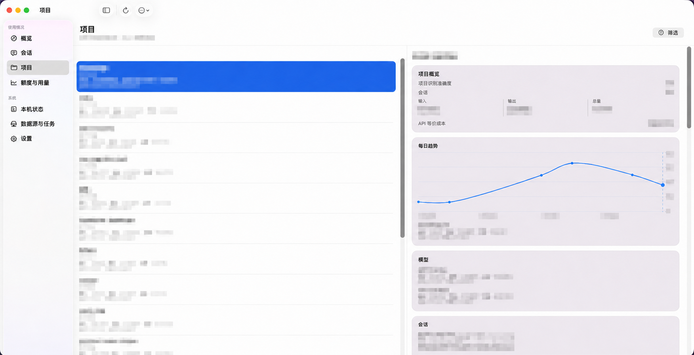

# Codex Pulse

English | [简体中文](README_CN.md)

**Understand how Codex and Cursor are being used on your Mac, how much quota or exact usage is available, and whether the underlying data is reliable.**

Codex Pulse is a local-first, native macOS app. It turns Codex and Cursor sessions, usage records, and source health scattered across your machine into a menu bar status view and a drill-down analytics interface, while making data freshness, completeness, and health explicit.



*Captured from a real Codex Home. Navigation and general product copy are preserved, while account, project, session, model, numeric, date, and runtime details have been irreversibly redacted. Chart shapes, colors, and layout are preserved.*

## Key features

- **Menu bar:** Pin Codex quota or Cursor's exact daily request/token status without changing the provider selected in the main window.
- **Usage analytics:** Explore tokens, models, API-equivalent cost, and activity distribution across overview, session, and project pages.
- **Provider context:** Switch the main window between Codex and Cursor; every query remains scoped to one provider and unsupported metrics stay explicitly unavailable.
- **Data status:** Inspect provider-grouped sources, local indexing, and background jobs to understand whether reported results are complete.

## Feature overview

| Area | What you can see |
| --- | --- |
| Menu bar | Remaining quota, cumulative tokens, reset times, and health alerts |
| Overview, sessions, and projects | Trends and heatmaps, model and cost breakdowns, high-usage sessions, and project-linked sessions |
| Status and settings | Quota periods and sources, indexing progress and freshness, background jobs, local storage, and settings |

The main window includes overview, session, project, and quota pages. Runtime diagnostics, data sources, and settings live in the System section. Use the menu bar for current status and the main window for usage details and data health.

## Product tour

The following screens were captured from a real Codex Home under the same redaction policy: fixed navigation and product copy remain readable, while dynamic project, session, model, numeric, cost, and time data has been irreversibly transformed.

### Overview: trends and activity distribution



### Menu bar

<p align="center">
  
</p>

### Project list and details



## When a value is uncertain

The most misleading failure mode for quota and usage tools is not missing data—it is presenting fallback values as facts. Codex Pulse follows these display rules:

- `0%` is shown only when exhaustion has been confirmed. Values that were never retrieved, have not been calculated, or do not apply are shown as `--`.
- If an online refresh fails but a previous successful result exists, the last-known-good value remains visible instead of suddenly changing to 100%.
- A time range that has not been fully indexed is marked as partial data rather than presented as a complete total.
- Quota names and periods come from current data. For example, period labels are derived from the actual `window_minutes` value instead of hard-coding a "5-hour quota."
- Currency values are always labeled as "API-equivalent cost." They help explain the public API price scale associated with token usage and do not represent an actual bill or charge.

## Local-first and privacy

All indexing and analytics run locally. Cursor usage and spending can additionally be refreshed from Cursor's authenticated Dashboard service by reusing the current Cursor Desktop session:

- Local Codex and Cursor sessions are discovered read-only. Structured results stay in local SQLite; conversation bodies, prompts, responses, thoughts, tool payloads, tracked file content, raw paths, credentials, and RPC tokens are not persisted.
- Online quota, reset-credit, and Cursor Dashboard requests use credentials only in memory for the duration of a request. Dashboard access tokens are read from Cursor's WAL-aware state database and are never copied to preferences, logs, RPC responses, or Codex Pulse SQLite. There is no Codex Pulse cloud sync or public network endpoint.
- The Swift app and Go Helper communicate only over a private Unix Domain Socket. Logs, errors, and UI responses exclude raw payloads, full paths, and underlying error details.

The original Codex and Cursor files remain managed by their applications. Codex Pulse stores only the allowlisted indexes, aggregates, lineage digests, and runtime state required by the product, and never modifies original session content.

On first launch, the Go Helper performs a metadata-only safety probe of `${CODEX_HOME:-$HOME/.codex}` without reading session bodies, then stores a stable identity for that directory. If the directory does not exist or the probe fails, Codex Pulse remains unconfigured and does not start indexing. Changing Codex Home later still requires explicit confirmation in Settings.

## How it works

Codex Pulse consists of two local processes:

```text
Local Codex data / optional online quota
             │
             ▼
   Go Helper: discovery, indexing, aggregation, scheduling, SQLite
             │  Protobuf / gRPC over UDS
             ▼
   Swift app: menu bar, windows, interactions, and Helper lifecycle
```

[`api/codexpulse/core/v1/core.proto`](api/codexpulse/core/v1/core.proto) defines the cross-process contract. The Go Helper reads, indexes, and aggregates data. The Swift app calls it through the generated CoreService client and neither reads SQLite or JSONL directly nor reimplements aggregation in the UI layer.

## Run from source

Requirements:

- macOS 15+
- Apple Silicon
- Go 1.26.2
- `protoc 34.1`

Local runs use the real `${CODEX_HOME:-$HOME/.codex}`. The following command reads session/JSONL data read-only and may write SQLite, preferences, runtime logs, and standard App Server housekeeping data inside a private app runtime. It does not modify original session content:

```bash
make verify-live
```

`make verify-live` builds the development app, reuses a confirmed private runtime, and launches the app against the real Home. CI, unit tests, and deterministic smoke tests use a synthetic or empty Home so they do not read personal data.

The Development bundle and an unbundled `swift run` executable refuse the installed product runtime at `~/Library/Application Support/Codex Pulse/runtime`. Development launches must pass an isolated `/private/tmp/cp-*` runtime explicitly; only the installed production bundle may use the persistent product database by default.

## Development and verification

For routine development, prefer the affected Go package tests or Swift executable tests. Common commands:

```bash
# Go and Swift test suites
make test-go
make test-swift

# Pre-commit product checks
make check

# Full PR/CI verification with an isolated Home
make verify

# Assemble a local unsigned preview candidate without creating a tag or GitHub Release
scripts/macos/build-release-app.sh \
  --version 0.1.0-beta.1 \
  --build-number 4 \
  --sparkle-feed-url \
    https://github.com/SisyphusSQ/codex-pulse/releases/download/updates/appcast.xml \
  --sparkle-public-key-file \
    /secure/path/codex-pulse-sparkle-public.key

# Regenerate Go and Swift sources after changing the Proto contract
make generate-proto
```

Release candidates are written to `.artifacts/releases/<tag>/`. Each candidate includes a first-install DMG, an Apple Silicon app ZIP with Sparkle embedded, and `SHA256SUMS` covering both assets. The DMG provides the standard drag-and-drop path from `Codex Pulse.app` to `/Applications`; the appcast continues to point only to the exact ZIP. The public key file may be public, but it must match the private key supplied through stdin when signing the appcast.

Stable and preview are product release channels. macOS trust is recorded separately as `unsigned` or `signed-notarized`. Stable defaults to `unsigned stable`: release assets use ad-hoc signing, and Release Notes must disclose that Developer ID signing and notarization are incomplete, the build is not Gatekeeper-trusted, and first launch requires choosing **Open Anyway** in **System Settings → Privacy & Security**. A remote release must also pass independent readback of the tag, Release, asset digests, pinned appcast, and first-launch flow. `signed-notarized` is an explicit opt-in and is allowed only after signing, notarization, Gatekeeper verification, and final asset readback all pass in the release environment. Preview releases continue to use prerelease SemVer and select either unsigned or signed-notarized assets according to what was actually produced.

Main directories:

| Path | Responsibility |
| --- | --- |
| [`app/macos/`](app/macos/) | Native SwiftUI/AppKit app, Core client, and executable tests |
| [`api/codexpulse/core/v1/`](api/codexpulse/core/v1/) | Protobuf contract and generated code |
| [`internal/`](internal/) | Go Helper indexing, queries, scheduling, persistence, and runtime implementation |
| [`docs/design/`](docs/design/) | Product, architecture, data, quota, scheduling, and observability design |
| [`docs/test/`](docs/test/) | Test guidance and redacted result summaries |

Start with these documents for more detail:

- [Product design](docs/design/details/product/README.md)
- [System architecture](docs/design/details/architecture/README.md)
- [Data model](docs/design/details/data-model/README.md)
- [Quota data](docs/design/details/quota/README.md)
- [Scheduling and initial indexing](docs/design/details/scheduling-and-bootstrap/README.md)

## License

[MIT](LICENSE)
