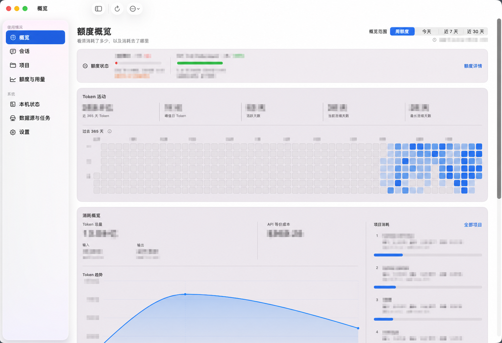
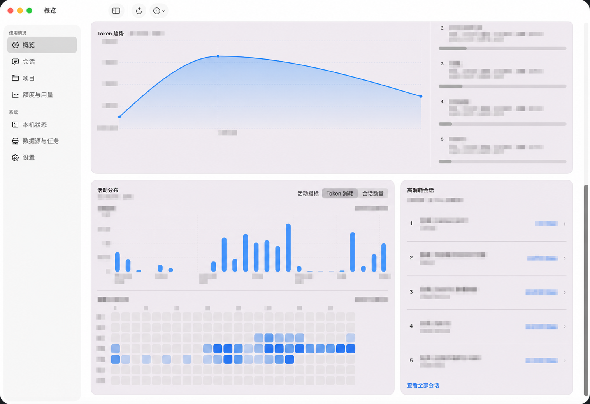
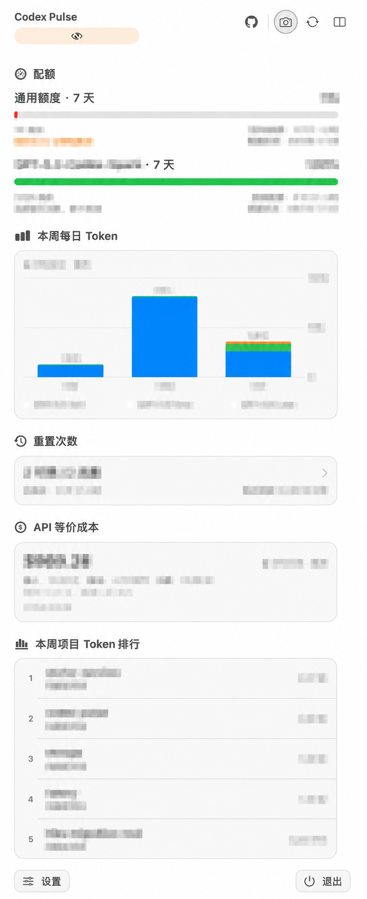
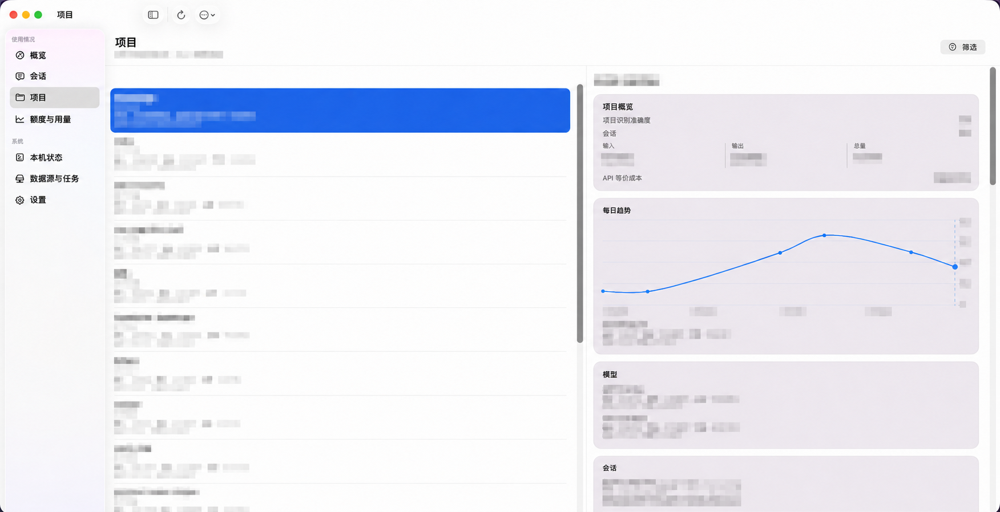

# Codex Pulse

[English](README.md) | 简体中文

**看清 Codex 与 Cursor 在本机如何消耗、额度还剩多少，以及当前数据是否可用。**

Codex Pulse 是一款 local-first 的原生 macOS 应用：把 Codex 与 Cursor 分散在本机会话、用量记录和数据来源健康中的信息，整理成菜单栏状态与可下钻的分析界面，同时说明数据的新鲜度、完整性与健康状态。



*基于真实 Codex Home 的界面截取；侧栏和通用产品文案保留，账号、项目、Session、模型、数值、日期和运行时明细均已不可逆脱敏，图表的形态、颜色与布局保留。*

## 主要功能

- **菜单栏**：固定 Codex 额度、Cursor 精确用量、Grok credits 或 DSH Token 用量，且不改变主窗口当前客户端。全部关闭时显示 `Codex Pulse --`。DSH 不显示剩余百分比。
- **用量分析**：在概览、会话和项目页面查看 Token、模型、API 等价成本与活动分布。
- **会话缓存命中率**：在 Codex 会话列表和详情查看缓存输入占全部输入 Token 的比例；缺失或异常计数保持不可用。
- **客户端开关**：在设置中独立启用或关闭 Codex、Cursor、Grok、DSH。发现只做 metadata-only 探测；显式关闭后重启、唤醒和数据源重新出现都不会自动重开。主窗口与 Popover 只列出已启用客户端；全部关闭时仍可进入设置。
- **客户端上下文**：主窗口在已启用的 Codex、Cursor、Grok、DSH 之间切换；每次查询只属于一个客户端，不支持的指标保持不可用。汇总不是第五个客户端。
- **Codex 账号**：设置页管理本机识别账号与手动记录；独立的「账号额度」页为当前账号和保留的历史账号使用完全相同的紧凑账号卡，并只展示每个账号真实返回的额度窗口。每个窗口按实际时长命名，展示最后验证的百分比、重置时间、数据状态与采集时间；历史卡片只读。设置中可控制以后确认切换账号时是否保留旧额度，并可显式清除既有历史；这不会改变按 Home 聚合的 Session、Token、项目和费用口径。
- **数据状态**：查看按客户端分组的数据来源、本机索引和后台任务的状态，了解统计结果是否完整。

## 功能概览

| 区域 | 你可以看到什么 |
| --- | --- |
| 菜单栏 | 额度剩余、累计 Token、重置时间和健康提醒 |
| 概览、会话、项目与账号额度 | 趋势和热力图、模型与成本拆分、项目关联的 Session，以及各已识别 ChatGPT 账号最后保留的额度快照 |
| 状态与设置 | 额度周期和来源、索引进度和新鲜度、后台任务、本机存储和设置 |

主窗口包括概览、会话、项目和配额页面；运行诊断、数据来源和设置位于系统区域。菜单栏用于查看当前状态，主窗口用于查看用量明细和数据状态。

## 产品界面

以下界面均基于真实 Codex Home 截取，并使用相同的脱敏规则：固定导航和产品文案可读，项目、会话、模型、数值、成本与时间等动态数据均已不可逆处理。

### 概览：趋势与活动分布



### 菜单栏

<p align="center">
  
</p>

### 项目列表与详情



## 数值不确定时

额度和用量工具最容易产生误导的地方，不是没有数据，而是把获取失败后的默认值当成真实结果。Codex Pulse 使用以下显示规则：

- `0%` 只表示已经确认耗尽；从未取得、尚未计算或当前不适用时显示 `--`；
- 在线刷新失败但已有上次成功获取的数据时，继续展示 last-known-good，而不是突然变成 100%。last-known-good 只留在当前已确认的 ChatGPT 账号内；切换账号不会复用上一个账号的百分比。
- Codex 在线额度与 Reset Credits 来自 Codex App Server 公开方法 `account/rateLimits/read`。Pulse 不读取 Codex access token、JWT、`auth.json` 或 Keychain，也不调用私有 WHAM。缺少 `accountId` 能力的 CLI 直接失败，不回退 WHAM。
- Codex Pro 5×/20× 只来自账号夹读得到的 App Server `planType`。Pulse 不用剩余百分比、Token、窗口、重置时间或 Reset Credits 推断档位。
- 本机 Session、Token、项目、趋势和 API 等价成本按当前 Codex Home 汇总，不按 ChatGPT 账号拆分。
- 可选中心的账号卡单独展示当前周额度周期内新记录的 Codex Token。只计算已确认的账号观测；含糊的切换差量和更早用量会跳过。见[账号周期 Token](docs/design/details/account-cycle-tokens.md)。
- 时间范围尚未索引完整时标记为“部分数据”，不把局部结果冒充完整统计；
- 额度名称与周期来自当前数据，例如按真实 `window_minutes` 生成周期标签，不硬编码“5 小时额度”；
- 金额始终标为“API 等价成本”，用于理解 Token 对应的公开 API 价格量级，不代表真实账单或实际扣费。
- Codex 每月续费日或会员到期日本期只支持手动维护，不会把 token 过期、额度重置时间或 Reset Credit 到期写成会员日期。

## Local-first 与隐私

所有分析都在本机完成：

- 只读发现和增量索引本地 Session，结构化结果只保存在本机 SQLite；不复制完整对话正文，也不持久化 token、Authorization header 或 RPC token。
- 在线 quota 与 Reset credits 可以关闭，凭证仅在请求期间进入内存；不提供云同步或公网访问。
- Swift App 与 Go Helper 只通过私有 Unix Domain Socket 通信；日志、错误和 UI 返回值不包含原始 payload、完整路径或底层错误。

Codex 原始文件仍由 Codex 自己管理。Codex Pulse 只保存产品功能所需的索引、统计和运行状态，不修改原始 Session 内容。

首次启动时，Go Helper 会初始化 Preferences v5，即使没有 Codex Home。会对 `${CODEX_HOME:-$HOME/.codex}` 做不读取会话正文的 metadata-only 安全探测；安全 Home 会保存稳定身份。目录不存在或探测失败时，应用仍可启动：设置、Cursor、Grok 和 DSH 继续可用，Codex 索引、额度和账号在配置 Home 前保持不可用。之后更换 Codex Home 仍需在设置中显式确认。关闭某个客户端会停止本地采集、在线请求、凭据续期、查询触发刷新和当前汇总；历史、进度和子开关偏好保留。设置中会预览旧版本未归属的本机配额历史，只有用户确认后才会将它用于当前账号的历史曲线，且可撤销。当前握手为 `core-rpc-v9`，Provider 控制面为 `provider-control-v1`。

## 工作原理

Codex Pulse 由两个本地进程组成：

```text
Codex 本地数据 / 可选在线额度
             │
             ▼
   Go Helper：发现、索引、聚合、调度、SQLite
             │  Protobuf / gRPC over UDS
             ▼
   Swift App：菜单栏、窗口、交互与 Helper 生命周期
```

[`api/codexpulse/core/v1/core.proto`](api/codexpulse/core/v1/core.proto) 定义了跨进程接口。Go Helper 负责读取、索引和汇总数据；Swift App 通过 generated CoreService 调用 Helper，不直接读取 SQLite 或 JSONL，也不在 UI 层重新汇总数据。

## 从源码运行

环境要求：

- macOS 15+
- Apple Silicon
- Go 1.26.2
- `protoc 34.1`

本地运行使用真实 `${CODEX_HOME:-$HOME/.codex}`。下面的命令会只读 Session / JSONL，并可能在私有 App runtime 中写入 SQLite、偏好、运行日志和 App Server 的常规 housekeeping；不会修改原始 Session 内容：

```bash
make verify-live
```

`make verify-live` 会构建 development App、复用已确认的私有 runtime，并使用真实 Home 启动应用。CI、单元测试和确定性 smoke 使用 synthetic / empty Home，避免读取个人数据。

Development bundle 和未打包的 `swift run` 可执行文件会拒绝已安装产品的 runtime：`~/Library/Application Support/Codex Pulse/runtime`。开发启动必须显式传入隔离的 `/private/tmp/cp-*` 或 `/tmp/cp-*`。只有安装包 bundle id `com.sisyphussq.codexpulse` 默认使用持久 runtime。

## 开发与验证

日常开发优先运行受影响的 Go package 或 Swift executable tests。常用命令如下：

```bash
# Go / Swift 分项测试
make test-go
make test-swift

# 提交前产品检查
make check

# PR / CI 完整验证，使用隔离 Home
make verify

# 组装本地 unsigned preview 候选，不创建 tag 或 GitHub Release
scripts/macos/build-release-app.sh \
  --version 0.1.0-beta.1 \
  --build-number 4 \
  --sparkle-feed-url \
    https://github.com/SisyphusSQ/codex-pulse/releases/download/updates/appcast.xml \
  --sparkle-public-key-file \
    /secure/path/codex-pulse-sparkle-public.key

# 修改 Proto 后重新生成 Go / Swift 代码
make generate-proto
```

发行候选写入 `.artifacts/releases/<tag>/`，包含首次安装 DMG、内嵌 Sparkle
的 Apple Silicon App ZIP 与覆盖两项资产的 `SHA256SUMS`。DMG 提供
`Codex Pulse.app` 到 `/Applications` 的标准拖拽入口；appcast 仍只指向
exact ZIP。公钥文件可公开，但必须与通过 stdin 用于 appcast 签名的私钥配对。
stable 与 preview 是产品发布渠道，macOS 信任等级另行记录为 `unsigned` 或
`signed-notarized`。stable 默认沿用 `unsigned stable`：发行资产采用 ad-hoc
签名，Release Notes 必须披露未完成 Developer ID 签名、未公证、非 Gatekeeper trusted，
以及首次打开时在“系统设置 → 隐私与安全性”中“仍要打开”的操作；远端发布还
必须经过 tag、Release、资产摘要、固定 appcast 和首次打开流程的独立读回。
`signed-notarized` 仅显式 opt-in，只有现场签名、公证、Gatekeeper 和最终资产
readback 全部通过时才允许。preview 仍使用 prerelease SemVer，并按实际资产
选择 unsigned 或 signed-notarized。

主要目录：

| 路径 | 职责 |
| --- | --- |
| [`app/macos/`](app/macos/) | 原生 SwiftUI / AppKit 应用、Core client 与 executable tests |
| [`api/codexpulse/core/v1/`](api/codexpulse/core/v1/) | Protobuf 接口定义与生成代码 |
| [`internal/`](internal/) | Go Helper 的索引、查询、调度、持久化和运行时实现 |
| [`docs/design/`](docs/design/) | 产品、架构、数据、额度、调度与可观测性设计 |
| [`docs/test/`](docs/test/) | 测试说明和脱敏结果摘要 |

更多细节从以下文档开始：

- [产品设计](docs/design/details/product/README.md)
- [系统架构](docs/design/details/architecture/README.md)
- [数据模型](docs/design/details/data-model/README.md)
- [额度数据说明](docs/design/details/quota/README.md)
- [调度与首次索引](docs/design/details/scheduling-and-bootstrap/README.md)

## License

[MIT](LICENSE)

## 多机汇总中心

可选的 Go Server 与 React/AntD Web 位于 [server/](server/README.md)，同源构建运行和 SQLite/MySQL 备份入口见 [运行说明](server/docs/test/operations.md)。原生 App 仍为本地采集与 UI，设置中配对、选择历史范围并显式启用上报；退出停止，下次增量补采。中心仅接收白名单元数据、统计、配额和 TPS，不接收原始记录或 Agent 凭据。中心结构按已有读回分层，后一次记录不覆盖前一次的失败、部分完成或未执行项。2026-10-03 的 v0.15.1/build 64、生产 schema 2→3 与 SeekDB 部署见[联调与发布读回](docs/test/multi-machine-reporting.md)；同日中心 schema v4 的构建是 `v0.15.1+center.9dbb1c5`，SQMC04 生产与 DEV 读回见[查询保留](docs/test/center-query-retention-20261003.md)与[交接](docs/test/center-query-handoff-20261003.md)。2026-10-05 的 v0.15.3/build 66 将生产 schema 从 v4 升到 v5，见[账号周期 Token](docs/test/account-cycle-tokens.md)。2026-10-06 的 v0.16.0/build 67 与 v0.16.1/build 68 见[DSH 验证](docs/test/dsh-provider.md)：生产中心读回为 `v0.16.1-53bcfc9`，schema 仍为 v5；三台 Mac 该次读回为 0.16.1/build 68，本机 SQLite v37、Preferences v5。独立 MySQL 8.4、三机完整故障矩阵、Sparkle 更新界面完整 E2E、公证和长期稳定性仍未关闭。DSH 生产读回收到会话不能写成完整 Mac→Server→Web E2E。

### DSH / DeepSeek Harness

DSH Mac 桌面版默认从 `~/.dsh/sessions` 导入官方 V3/V4 JSONL 和 Zstd 会话，支持现有 Session、项目、模型、缓存、活动、吞吐量、本地工具统计和可选中心上报。Mac 和中心 Web 均保持独立 `dsh` 客户端范围。全部费用以美元展示，按实际模型路由与请求起始时间选价：DeepSeek 使用峰谷 API 公价，`openai-codex` 使用已有 OpenAI Standard 基础文本历史价格。费用为 API 公价估算，桌面账户或 Codex 订阅的实际扣费与官方额度不由日志推定。价格、格式、隐私和早期历史 unknown 边界见 [DSH 设计](docs/design/details/providers/dsh.md)，验证见 [DSH 验证记录](docs/test/dsh-provider.md)。
