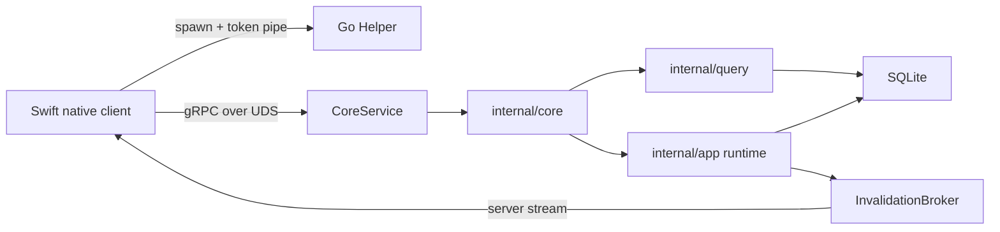

# Architecture

## 当前运行时

Codex Pulse 当前采用 Swift-native client（后续仓库任务）+ Go Helper 的进程边界。Go Helper 是数据、索引、调度、quota、settings、Home switch、migration recovery 和健康口径的唯一业务真相。

## 责任边界

| 组件 | 负责 | 不负责 |
| --- | --- | --- |
| `api/codexpulse/core/v1` | 版本化跨语言 DTO/RPC contract | 数据访问、UI |
| `internal/helper` | UDS 安全、pipe token、gRPC、进程收口 | 业务口径、桌面 UI |
| `internal/core` | 业务 allowlist、typed mapping、错误归一化、invalidation | socket、SQLite owner |
| `internal/app` | 后台 runtime 装配与逆序 drain | window/tray/updater |
| `internal/query` / `internal/store` | 查询、聚合、SQLite 真相 | 跨进程 transport |
| Swift client（后续） | AppKit/SwiftUI、窗口、菜单栏、更新、Helper 托管 | 重定义 Go 业务事实 |

## 安全与停止

- Helper 只接受绝对 UDS path，验证父目录为当前 UID、`0700`、非 symlink；socket 为 `0600`。
- 一次性 token 不进入 argv、环境变量、日志、数据库或错误 surface；Go 内存只保留 SHA-256 摘要。
- unary 与 stream 共用鉴权 interceptor；业务 context 直接继承 RPC deadline/cancellation。
- invalidation 是 content-free 的重新查询提示；每个订阅者使用有界队列，慢消费者不反压 writer。
- shutdown 顺序为停止 RPC admission、drain 已接纳调用、停止后台 worker、关闭 SQLite、删除 socket。
- schema migration failure 进入 recovery-only RPC，不启动正常业务图。

## Contract 真相

`api/codexpulse/core/v1/core.proto` 是 Swift/Go 唯一跨进程 contract。`make verify-proto` 在临时目录用固定 generator 版本重生成并比较，禁止手改生成文件。Updater、Window、Tray 和 Popover 明确不属于 `CoreService`。
