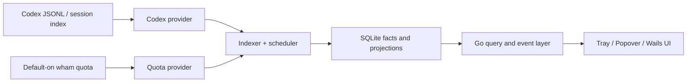
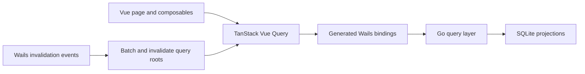

# Architecture

## 总体结构

Codex Pulse 采用本机只读数据源、结构化 SQLite 事实层、Go 查询服务和 Wails3 UI 的分层结构。



外部 JSONL 是事实源，但不是 Tracker 的数据资产。Tracker 只保存支持统计、可信状态和恢复所需的有限结构化字段。

## Go 后端模块

- `internal/codex/logs`：只读 `sessions` / `archived_sessions`，按 offset 增量解析 JSONL。
- `internal/codex/index`：读取 `session_index.jsonl`；修复能力必须 dry-run 后显式确认并备份。
- `internal/codex/quota`：本地 JSONL rate limits 与默认启用、可关闭的 `wham/usage` / reset credits；不接入 app-server。
- `internal/indexer`：识别完整 JSONL 行、生成幂等结构化事实并提交游标。
- `internal/scheduler`：分数据源周期、失败退避、前后台优先级和扫描预算。
- `internal/store/sqlite`：桌面进程唯一 SQLite 连接面，负责应用数据路径、WAL/pragma 读回、有界单写队列、独立只读池和 drain/close；上层 `internal/store` repository 后续承载 facts、current projection、daily rollup、source cursor 和 job run。
- `internal/pricing`：版本化 pricing catalog 和本地 override。
- `internal/privacy`：路径/remote 脱敏和敏感字段过滤。
- `internal/query`：Wails 前的版本化公共查询 contract；统一有界分页、allowlist 排序/筛选、本地日到 UTC、跨端安全整数、unknown/null/真实零和 typed error，不依赖 Store model 或具体页面。
- `internal/health`：最近 24 小时运行指标、health event 和 Data Health 查询。
- `internal/updater`：更新状态机、安全重启屏障和平台 adapter。
- `internal/tray`：状态栏摘要、Popover 和原生菜单。
- `internal/app`：Wails bindings、query、refresh 和增量事件。

### 公共 Query Contract

`internal/query` 固定 `query-v1` 非泛型 DTO，供 M6 的 usage/session/project 与 quota/source/job/health/settings query service 组合。每个 endpoint 先构造 immutable `Specification`，声明允许的 sort/filter 字段、operator、默认 limit、最大 limit、日期范围和稳定 tie-breaker；客户端字符串只有通过 allowlist 和 arity 校验后才能进入业务 service。公共层只返回 `ValidatedRequest`，不拼接 SQL、不访问 SQLite，也不把 GORM model、数据库 row 或内部主键暴露给 Wails。

分页 cursor 对前端保持有界 opaque token，具体 keyset payload 和 endpoint scope 由对应业务 query 拥有，不依赖进程内 page lookup 状态。敏感 Session Turn cursor 使用 process-lifetime 随机 AEAD key 认证加密，app process 重启时前端 cache 与旧 cursor 一起失效；Store typed cursor 仍可跨同一 SQLite reopen 继续分页。业务列表必须组合稳定 tie-breaker 且 limit 不超过公共 hard cap，已知空列表返回 `[]`；v0.1 不提供无限制全表导出。

`SessionDetail` 在既有方法内接受 bounded `turnPage`，并在同一次 `Store.View` snapshot 返回 Session aggregate 与 content-free Turn usage/cost page。Store 通过固定 GORM projection 按 `started_at_ms DESC, turn_id DESC` 读取安全 attribution、lifecycle、同 generation usage 与可选 active cost；query 层负责 AEAD cursor、Session 绑定、不可逆 timeline key、unknown/zero/priced/unpriced 映射，以及完整首屏精确/截断页下界与 pricing membership 对账。该扩展不增加 schema、index、Wails method 或 event domain，也不把 raw identity、正文、tool、路径、offset、generation、SQL 或 driver cause 带到 generated DTO。

`ProjectDetail` 也在既有方法内扩展 `sessionPage/modelPage`。Store 于同一 `Repository.database.View` 中锁定 active cost generation，以 GORM `Table/Select/Joins/Where/Group/Having/Order/Limit/Scan` 从 final `turn_usage`、同 generation `turn_costs`、`turn_attributions`、`session_attributions` 组装 Project contribution；全量 Session groups 与 Model groups 各自作为 grouped subquery，再由 NULL-preserving 外层 aggregate 只扫描一行并对账 Project item，翻页只读取 limit+1。Session keyset 固定为 `lastActivityAtMs DESC, sessionId DESC`，Model keyset 固定为 `totalTokens DESC NULLS LAST, modelDimensionKey DESC`。Query 层的双 AEAD cursor 绑定 endpoint、Project dimension、timezone/range、active generation 与 sort identity；process 重启或同进程 generation rollover 后旧 cursor 均失效，调用方从首页恢复。

用户日期范围以本地 `YYYY-MM-DD`、exclusive end 和显式 IANA timezone 输入，由 Go 在 DST-aware 本地午夜换算成 `[start,end)` UTC epoch milliseconds。token、count 和微美元继续使用非负整数；跨 Wails 的数值不得超过 JavaScript safe integer。`value != nil && value == 0` 表示真实零，`value == nil` 必须同时带有限 `unknownReason`；partial 与 unavailable 通过 response status / typed issue 表达，不能用空数组、零或任意错误文本代替。

fatal failure 只映射稳定 code、i18n message key、allowlisted field 和 retryable，不把 repository/driver cause 暴露到 JSON、日志或页面。内部仍保留 `errors.Is` / `errors.As` chain，便于 Go service 做正确分类和恢复。

### Wails Binding Contract

`internal/app.Service` 是唯一注册给 Wails 的业务 façade。它用真实 `store.Repository`、Quota Current reader 和共享的 Preferences `FileStore` 装配 M6 query service，但所有依赖字段保持私有；Repository、GORM、SQLite handle、文件、shell、网络和 credential primitive 都不能进入生成面。应用生命周期与查询 façade 复用同一个 Preferences loader，避免同一进程读取两份不同配置快照。

`wails-bindings-v1` 当前只允许以下 query：`Bootstrap`、`Contracts`、`UsageCost`、`ListSessions`、`SessionDetail`、`ListProjects`、`ProjectDetail`、`QuotaCurrent`、`ListSources`、`Source`、`ListJobs`、`Job`、`ListHealth`、`Health`、`HealthProjection`、`Settings`；command 精确为 `RequestQuotaRefresh`、`UpdateSettings`、`PlanHomeSwitch`、`ConfirmHomeSwitch`、`RecoverHomeSwitch`、`RunRuntimeAction`、`AnalyzeSessionIndexRepair`。`HealthProjection` 只映射进程内 evaluator 的有限七组件只读快照，不暴露 event、路径、原始错误或恢复 primitive。`Contracts` 返回 binding/query/业务 contract 版本、完整 method allowlist、精确 command allowlist 和一个 typed error exemplar。所有 command 只接收有限 enum/DTO 并返回不含 source instance、scope、claim、Home path、device/inode、data-store key、plan/switch/attempt/session ID 或 raw cause 的 receipt；Schedule、任意 shell/SQL/filesystem primitive、repair Execute 与 Preferences persistence model 保持不可绑定。新增 exported method 必须先让 exact allowlist contract test 失败，再通过独立 Issue 和 review。

TOO-307 只扩展既有 `SessionDetailRequest/Response` 的 reachable model：request 增加 `turnPage`，response 增加 non-nil `turns` 与 `turnPage`；当时生成结果保持 15 methods、13 个业务 query 和 1 个 event。前端 fixture 与 query key 必须携带完整 page request，generated bindings 仍是唯一 TypeScript 类型真相。

TOO-308 只扩展既有 `ListProjects` item 与 `ProjectDetailRequest/Response` reachable model：list item 增加 exact `sessionCount` 和末尾最多 30 个日点的 `trend`，detail 增加双 bounded page 与安全 Session/Model contribution item。当时生成结果仍保持 1 service / 15 methods / 1 event；前端必须把完整双 page request 纳入 query key/cancellation，不得另增业务入口或手写 shadow type。

TOO-276 新增第 16 个 generated method `RequestQuotaRefresh`。`Service` 在 Wails application 构造后、`desktopApp.Run` 前把既有 application lifecycle runtime 单次绑定到私有 command slot；未完成 onboarding、nil 或重复绑定均 fail closed。command 只转发 source，节流、Retry-After、durable claim、credential 读取和提交后 invalidation 都继续由既有 runtime/coordinator 负责；跨端 receipt 只含 source、next due、reason 与 last manual time。

TOO-275 的 Vue adapter 直接消费上述 generated model。`ProjectsRouteState` 只持有限 range/confidence/sort/direction、opaque list cursor 与 selected Project；纯 request composer 生成 `Request` / `ProjectDetailRequest`，TanStack Query 继续是唯一 cache/cancel owner。list cursor 可由 URL 恢复，Session/Model AEAD cursor 只保存在组件 scope 并拥有独立 history/transition guard；Project、range、generation validation 或进程变化不允许复用旧 detail page。跨本地午夜只由共享 lifecycle-owned one-shot local-date clock 推进 request/query key，不新增业务 scheduler 或周期事实源。

13 个业务数据 query 的 `context.Context` 位于首参数，Wails 生成的 TypeScript client 返回 `CancellablePromise<T>`，前端取消会传播到 Store/query；同步元数据方法 `Bootstrap` / `Contracts` 不承诺 Go 侧可取消。业务方法返回 error 或其依赖 panic 时，façade 会统一生成 `RuntimeError`：`CallError.message` 固定为 `binding query failed`，`cause` 只包含 `query.ErrorEnvelope`。Wails 在参数数量或 JSON 类型错误时生成的 `TypeError.message` 属于 framework transport detail，前端不得展示；其 `cause` 仍通过 content-free marshaler。内部 error chain 保留取消、deadline 和分类语义，但底层路径、请求值、panic value、repository/driver cause 不进入业务 RuntimeError JSON。

`frontend/bindings` 是 Go method signature 生成并提交的唯一跨端类型真相。正常生成必须通过稳定 diff gate；失败注入会对 tracked 与尚未跟踪的 generated files 做 SHA-256 前后读回，任何旧 bindings 被覆盖或部分更新都以 `BINDING-001` fail closed。Vue 层不得手写同名 request/response/enum/error shadow type。

### Wails Event 与 Query Cache Contract

后台变化只通过一个 custom event `codex-pulse:query-invalidated` 通知前端。Go 在 `init` 中直接注册 `QueryInvalidationEvent`，由 Wails generator 生成 TypeScript `CustomEvents`；payload 固定为 `query-invalidation-v1` 与有限 `index/quota/health/settings` domain，只表示“相关 query 可能过期”。事件禁止携带 session、quota window、health item、settings snapshot、cursor、path、credential、错误正文或其它业务事实。

index scheduler cycle、quota refresh 和 Preferences settings 分别在 durable commit 成功后通知；提交失败不发事件。settings 一旦提交即通知 `settings` 与 `quota`，后续 reconcile 失败不会隐藏已提交真相。emit 前先验证并序列化固定 DTO；序列化或 emitter panic 不污染前端 cache，而是用 content-free `runtime.unknown` health observation 记录。事件本身是 best-effort hint，不参与提交结果，也不成为重放日志。

Vue Query 的 key factory 覆盖 13 个业务 binding，业务 request 的 page/sort/filter/range/detail identity 都完整进入 key。Quota current 使用稳定 singleton key，每次 queryFn 才读取当前 evaluation clock，避免周期刷新沿用首次时刻。每个 queryFn 都把 TanStack `AbortSignal` 绑定到 generated `CancellablePromise.cancelOn`，observer卸载或查询替换会把取消传播到Go。usage/index stale time 与 active refetch interval 为 15 秒，quota/source/job/health 为 5 秒，settings 为 60 秒；background interval关闭，进程静态 `bootstrap` 保持永久新鲜且不进入业务失效集合。domain 只映射到固定 query root，50ms 批次内用集合去重，并以 `invalidateQueries({ exact: false, refetchType: "active" })` 触发 active query 重取；禁止事件 handler 调用 `setQueryData` 或把 payload 当事实写入 cache。

事件允许丢失、重复和爆发。持续前台的 active query 按上述 interval 有界重取；inactive query 再次观察时按 stale 状态重取。`SystemDidWake`、`WindowRuntimeReady` 与 macOS foreground 统一失效全部业务 root，作为断连/睡眠/进程版本偏差的恢复入口；malformed/未知 event version/domain 同样 fail closed 到全业务失效。Vue app 卸载时必须执行四个 unsubscribe、清空 pending roots 并取消 batch timer，observer卸载后不得继续周期重取。

未来如恢复多 agent，provider 抽象可沿用：

```go
type Provider interface {
    Name() string
    DefaultRoots() []string
    Discover(ctx context.Context) ([]SourceRef, error)
    Watch(ctx context.Context, changes chan<- SourceChange) error
    Fingerprint(ctx context.Context, src SourceRef) (Fingerprint, error)
    Parse(ctx context.Context, src SourceRef) (ParseResult, error)
}
```

v0.1 不为了抽象完整性提前实现 Claude/OpenCode provider。

## Wails3 + Vue 3 前端

### 技术栈

| 层级 | 选择 | 职责与边界 |
| --- | --- | --- |
| 桌面壳与绑定 | Wails3 | Go 方法绑定、增量事件、窗口、系统托盘和平台能力；固定到经过验证的具体版本，不追随 master。 |
| 应用框架 | Vue 3 + TypeScript | 使用 Composition API 和 `<script setup>` 组织页面、组合式逻辑与类型；不使用 JSX 作为默认写法。 |
| 构建工具 | Vite | 前端开发、构建和静态资源处理；由 Wails 构建流程统一调用。 |
| 路由 | Vue Router | 承载概览、会话、项目、配额、本机状态和设置页面；Data Health 作为本机状态的二级路由，Popover 与 Tray 不作为普通路由页面。 |
| 样式系统 | Tailwind CSS v4 | 设计 token、响应式布局、状态样式和 Liquid Glass 表面实现。 |
| 基础交互 | shadcn-vue + Reka UI | 选择性引入并持有组件源码；用于按钮、菜单、弹窗、Popover、Tooltip、Switch 等可访问性基础交互，不作为整套后台主题。 |
| 图表 | Apache ECharts | 用量趋势、模型/项目分布和成本分析；图表配置封装为业务组件，页面不直接堆叠 option。 |
| 表格 | 语义原生 table；按证据再引入 `@tanstack/vue-table` | Sessions v0.1 的排序、筛选与稳定分页全部由后端 query contract负责，前端用语义原生 table 保留服务端顺序；只有后续出现共享列定义或虚拟化证据时才引入额外依赖。 |
| 异步数据 | `@tanstack/vue-query` | 包装 Wails Promise 查询、缓存、失效和刷新状态；Wails events 只定向失效并重取，不把 payload 写成业务事实。 |
| 客户端状态 | Vue Composition API；必要时 Pinia | 页面局部状态优先使用 `ref` / `computed` / composable；只有跨页面 UI 偏好、会话级状态确有需要时才引入 Pinia。业务事实不在前端复制一份长期 store。 |
| i18n | Vue I18n | v0.1 只打包 `zh-CN`，所有可见文案仍通过稳定 message key 访问。 |
| 图标 | `@lucide/vue` | 普通功能图标；应用图标、状态栏模板图标和品牌资产单独维护，不直接用 Lucide 代替。 |
| 测试 | Vitest + Vue Test Utils | composable、组件状态和关键交互测试；对可访问性、键盘操作和数据空值语义建立回归用例。 |

版本号在正式代码仓库初始化时统一锁定，并提交 lockfile。首版不额外引入通用大组件库，也不同时混用多套基础组件体系。

### 前端数据流



- Go / SQLite 是业务事实与聚合口径的唯一权威来源；Vue 不重新实现配额仲裁、成本计算或 Session 状态推导。
- 页面首次进入时通过生成的 Wails bindings 查询；刷新按 query key 精确失效，不设置全局 loading。
- quota、live append、backfill、health 和 settings 等后台变化只发布有限 invalidation event；前端失效受影响的 query root 并从 Go 重取，不从 event payload 更新业务事实。
- 组件不得直接读取 `~/.codex`、SQLite 或凭证文件。
- `/sessions` 由 Router query 的纯 parse/normalize/serialize、generated Request assembler、TanStack list/detail queries 与展示组件组成。URL保存有限筛选、list cursor和selection；Turn cursor仅存在于 composable/page `ref`，两类 cursor 都不解析。该页面不新增 binding、Pinia、第二 cache 或本地业务聚合。

### 页面范围

- 概览：默认落地页；显示 5 小时 / 本周 quota 摘要、今日 / 7 天 / 30 天 / 自定义区间、token 构成、API 等价成本和每日明细。
- Sessions：thread、项目、模型、active turn、最后活动、token 和 API 等价成本；列表使用后端 stable keyset page，详情下钻到 content-free Turn usage/cost timeline，URL恢复与两级 cursor生命周期按 query contract隔离。
- Projects：按 workspace/repo 聚合使用量和最近 Session。
- Quota：本地/在线来源、窗口代际、刷新记录、reset credits 和冲突解释。
- 本机状态：数据完整性、索引新鲜度、来源、后台任务、存储和最近运行记录。
- Settings：Codex home、在线 quota、隐私、价格表、刷新和更新。
- Data Health：从本机状态下钻，不作为独立主导航项。

平台 tray、更新器、签名、透明窗口和系统目录通过 adapter 隔离，避免 Vue 组件与 macOS API 直接绑定。`internal/app.Run` 同样是 SQLite 生命周期装配边界：进程启动只打开一个 Store，Wails 退出后先 drain 已接受写入，再关闭连接。

### Liquid Glass 实现边界

- Wails 平台窗口配置负责原生透明度、窗口行为和系统托盘；Vue / CSS 负责玻璃表面、描边、tint、阴影与内容层级。
- macOS 双行额度状态项通过平台 tray adapter 实现；如果 Wails3 默认 tray API 不能承载自定义双行进度内容，则使用 AppKit 自定义 `NSStatusItem` 视图或预渲染组合图像，不把该布局逻辑泄漏到业务层。
- 玻璃只用于侧栏、Popover、工具栏和关键操作层；数据表格、长路径和主要数字使用高可读的近实色表面。
- shadcn-vue 只提供可维护的组件源码起点，最终视觉以 Pencil 设计 token 为准，不沿用默认主题拼装页面。
- `prefers-reduced-motion`、Reduce Transparency 和高对比替代表面需要进入组件验收；动画不能承担唯一状态表达。

### i18n 边界

- v0.1 只打包 `zh-CN`，不提供语言选择器或英文语言包。
- 可见文案使用稳定 message key 和集中语言目录，不把中文字符串散落在页面组件与业务逻辑中；例如 `nav.dashboard`、`nav.usage`、`quota.remaining`。
- `zh-CN` 同时是 v0.1 的默认语言和 fallback；缺失 key 必须在开发期可检测，不能静默显示空白。
- 模型名、绝对路径、Session ID、Git remote 等事实字段不翻译；日期、数字和相对时间通过 locale-aware formatter 输出。
- 后续增加语言包只扩展 message catalog 和格式化规则，不修改 SQLite schema、业务状态或 API contract。

## 隐私与安全

- 默认 local-first，只读本机文件，不上传数据。
- SQLite 不保存完整提问、回复、工具输出或原始 JSONL 行。
- `auth.json` 只在在线 quota 或 reset credits 开启时读取；两项新安装默认开启，关闭后停止对应在线请求，access token 始终只进入内存。
- token、refresh token、Authorization header、Cookie 和 auth 文件内容不能进入数据库、日志或 crash report。
- 本地 SQLite 可以保存项目和 cwd 完整绝对路径，以支持打开目录。
- Git remote 入库前删除用户名、密码、token、query 和 fragment。
- 应用不修改 Codex home；session index repair 是唯一计划内写入能力，并且必须显式触发、dry-run、确认和备份。
- 未来远程/手机访问必须单独授权，默认只绑定 loopback 或 Tailscale，不直接暴露公网。

## 本机数据目录

macOS v0.1 固定使用：

```text
~/Library/Application Support/Codex Pulse/
  codex-pulse.db
  settings / preferences
  logs/
  backups/
```

应用数据目录只允许当前用户访问。`internal/store/sqlite` 通过 `os.UserConfigDir` 解析该路径，将默认 `Codex Pulse` 专用目录收紧为 `0700`、DB 文件收紧为 `0600`，并拒绝最终数据目录或 DB 文件是 symlink。显式自定义 Path 的既有父目录/文件只校验、不 chmod，避免改变调用方共享目录权限。SQLite 不放进 `~/.codex`。onboarding 和 updater 关键偏好独立于主数据库，确保数据库损坏或 migration 失败时仍能恢复和检查更新。
