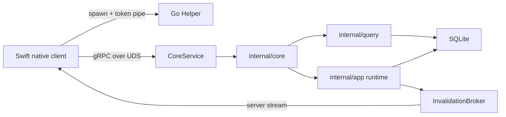

# Architecture

## 当前运行时

Codex Pulse 当前采用 Swift-native client（后续仓库任务）+ Go Helper 的进程边界。Go Helper 是数据、索引、调度、quota、settings、Home switch、migration recovery 和健康口径的唯一业务真相。

```mermaid
flowchart LR
    Swift["Swift native client"] -->|"spawn + token pipe"| Helper["Go Helper"]
    Swift -->|"gRPC over UDS"| RPC["CoreService"]
    RPC --> Core["internal/core"]
    Core --> Query["internal/query"]
    Core --> Runtime["internal/app runtime"]
Query --> Store["SQLite"]
    Runtime --> Store
    Runtime --> Broker["InvalidationBroker"]
    Broker -->|"server stream"| Swift
```

## 责任边界

| 组件 | 负责 | 不负责 |
| --- | --- | --- |
| `api/codexpulse/core/v1` | 版本化跨语言 DTO/RPC contract | 数据访问、UI |
| `internal/helper` | UDS 安全、pipe token、gRPC、进程收口 | 业务口径、桌面 UI |
| `internal/core` | 业务 allowlist、typed mapping、错误归一化、invalidation | socket、SQLite owner |
| `internal/app` | 后台 runtime 装配与逆序 drain | window/tray/updater |
| `internal/query` / `internal/store` | 查询、聚合、SQLite 真相 | 跨进程 transport |
| Swift client（后续） | AppKit/SwiftUI、窗口、菜单栏、更新、Helper 托管 | 重定义 Go 业务事实 |

客户端维度通过窄 `AgentProvider` seam 路由；当前客户端是 `codex`、`cursor` 和 `grok`。Cursor 或 Grok 的多种本地或可选在线来源只在 Helper 内部合并，不暴露成多个业务 Provider，也不并进 Codex 索引器。跨客户端汇总是独立 query RPC `DashboardSummary`，由 Helper 对齐当前范围后聚合 Provider slice，并在独立的 365 天本地日范围内聚合年度活动；两个范围分别返回 coverage，年度局部失败不能抹掉当前范围结果。Swift 不得自行请求三份结果后重算。详细契约见 [Agent Provider、Cursor 与 Grok](../providers/README.md)。

## 安全与停止

- Helper 只接受绝对 UDS path，验证父目录为当前 UID、`0700`、非 symlink；socket 为 `0600`。
- 一次性 token 不进入 argv、环境变量、日志、数据库或错误 surface；Go 内存只保留 SHA-256 摘要。
- unary 与 stream 共用鉴权 interceptor；业务 context 直接继承 RPC deadline/cancellation。
- invalidation 是 content-free 的重新查询提示；每个订阅者使用有界队列，慢消费者不反压 writer。
- shutdown 顺序为停止 RPC admission、drain 已接纳调用、停止后台 worker、关闭 SQLite、删除 socket。
- schema migration failure 进入 recovery-only RPC，不启动正常业务图。

## Contract 真相

`api/codexpulse/core/v1/core.proto` 是 Swift/Go 唯一跨进程 contract。`make verify-proto` 在临时目录用固定 generator 版本重生成并比较，禁止手改生成文件。Updater、Window、Tray 和 Popover 明确不属于 `CoreService`。

## 多机中心服务扩展（方案已整理，尚未实施）

[多机汇总、中心服务与 Web 看板](../multi-machine-reporting/README.md) 描述未来可选的结构化上报与集中查询，不代表当前已开放网络服务。现有本机 UDS、pipe token 与 Go 业务真相边界仍按本页执行；中心采用独立数据库及网络 contract，不将本机控制 RPC 开放到网络。

中心采用 Go Web Starter v2、MySQL 和独立 Go module，前端 AntD 放在 `server/web/`，不增加 `backend/` 层。HTTPS 与私网 HTTP 共用设备码配对和凭证权限体系，不另接 Tailscale SSO。现有本机业务与网络中心各自装配运行时，不共享数据库。

已确认保留 App 托管 Helper：退出 App 后停止采集和上报，下次打开增量补采并恢复待发送队列；未观测的配额历史保留缺口。实施按 3 个 Master、14 张 Execution 组织，中心开发阶段暂用 SQLite，同时实现 MySQL 支持，真实 MySQL 整体联调待环境提供后进行。
