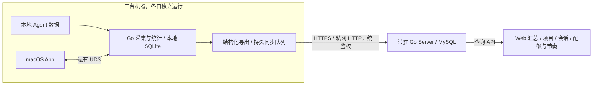

# 多机汇总、中心服务与 Web 看板

状态：已批准实施；保留 App 托管 Helper，退出后停止采集并在下次启动增量补采。更新时间：2026-10-01。

本文整合已讨论并暂定的技术方向、数据边界、统一设备码鉴权、网络入口和 Master/Execution 拆分。用户已授权创建并细化 3 个 Master、17 张 Execution，切出实施分支并完成前后端开发。本阶段使用 SQLite 开发验证，同时实现 MySQL 支持；用户提供 MySQL 后再进行真实 MySQL 整体联调。生产部署与正式发布另行处理。中心采用 Go Web Starter v2 和独立 Go module，前端源码放在 `server/web/`，构建后通过 Go `embed` 编入 Server，Web 与 API 单体部署；HTTP 与 HTTPS 共用设备码配对和凭证体系。

## 决策摘要

| 项目 | 状态 | 内容 |
| --- | --- | --- |
| 多机集中查看 | 已确认需求 | 将三台机器分别采集的 Agent 用量统一展示，保留设备来源和数据覆盖信息 |
| 中心服务 | 已确认需求 | 新增常驻 Server，接收本机主动上报，提供集中查询和 Web 看板 |
| 配额与节奏 | 已确认需求 | 上报当前配额、reset 时间与可信历史观测，支持中心节奏视图 |
| 业务元数据 | 已确认数据边界 | 允许原始账号 ID、邮箱、项目名、会话标题、原始 Session ID 与关联关系 |
| 原始内容与凭据 | 已确认排除 | 不上报原始 JSONL、会话正文、完整 auth.json、API Key、Token、Cookie 或其他认证材料 |
| Web 界面 | 已确认方向 | 使用前端框架，延续现有汇总页的布局、本地化与产品能力 |
| 中心代码组织 | 已确认方向 | `server/` 本身作为普通 Go Web 项目，前端放 `server/web/`，不增加 `backend/` 层 |
| 后端与数据库 | 暂定采用 | Go Web Starter `v2.0.0`，沿用 Echo v5、Uber Fx 和 MySQL 组件；本机继续使用独立 SQLite；中心开发测试暂用 SQLite，MySQL 整体联调后续进行 |
| 前端技术栈 | 暂定采用 | React + TypeScript + Vite、Ant Design、ECharts |
| Go module 与版本 | 已确认方向 | Server 与现有 Helper 分开 module；后续统一工具链及共同依赖到确认的最新稳定版本，并固定版本 |
| 网络与鉴权 | 已确认方向 | HTTPS 与私网 HTTP 共用业务 API、设备码配对、凭证校验、权限及撤销，不接入第二套 Tailscale SSO 或账号密码体系 |
| 任务组织 | 暂定拆分 | 3 个 Master、17 张 Execution；子卡全是执行卡，正式验收留在 Master |
| 本机采集生命周期 | 已确认 | 退出 App 后停止采集和上报，下次打开增量补采；不新增独立后台采集进程 |
| 部署与运行参数 | 实施前细化 | 部署机器、绑定地址、访问范围、备份、保留期限、首次补传范围、同步频率与资源预算 |

## 背景与现有事实

Codex Pulse 已在每台机器上提供本地使用量与额度观测，但没有中心同步能力，用户需要分别查看三台机器。现有汇总页参考掘金 AI Usage 的信息布局，并加入本地化、数据完整性、API 等价成本和独立额度等语义。

当前运行时是原生 Swift macOS App + Go Helper：

- Go Helper 拥有索引、SQLite、调度、用量、配额与健康口径；Swift 不直接读 SQLite、JSONL 或重算 Go 业务事实。
- App 通过启动 pipe 提交一次性鉴权材料，并使用私有 UDS 调用 CoreService。Helper 生命周期绑定父进程，不能直接作为独立后台服务启动。
- 现有 Provider 为 Codex、Cursor、Grok；本方案保留 Provider 维度，能力缺失时保持明确不可用，不为不同 Provider 补造相同额度窗口。
- Codex 本地 Session、Token、项目、趋势与成本按当前 Codex Home 聚合；在线 Quota、Pace、Reset Credits 按已确认账号 binding 隔离。
- Codex 原始账号 ID 当前只短暂存在于内存，以安装级 HMAC 生成本地 scope。不同安装的 scope 不承担跨机器账号身份。

相关现行设计：[架构](../architecture/README.md)、[产品](../product/README.md)、[Provider](../providers/README.md)、[数据模型](../data-model/README.md)、[配额](../quota/README.md)、[账号与订阅](../codex-subscriptions/README.md)。

本文确定未来可选中心同步的总体方案，不将其描述成现有运行时已支持，也不自动改变现行本机 RPC 的隐私与安全规则。

## 目标

1. 在一个 Web 看板查看三台机器的已知用量、趋势、工具与模型构成，并下钻项目与会话。
2. 按真实账号与额度窗口集中查看配额、reset 和节奏，明确采集时间、来源与可信状态。
3. 本地统计在网络或中心服务不可用时继续工作，恢复后可补传并对账。
4. 保留业务元数据与结构化统计，避免原始内容、认证凭据进入中心存储、响应、日志或提交版证据。
5. 同仓库维护桌面端与中心服务，保持各自的运行时、数据库、接口与发布边界。

## 范围与排除项

范围包括本机结构化导出与上传、中心接收与存储、身份关联、去重、汇总查询、Web 页面、设备接入、同步状态、历史补传和对账。

本方案不包含上传或同步原始会话文件、远程浏览正文、中心代持 Agent 登录凭据、账号登录切换、远程执行命令、公开排行榜或默认公开分享。非 Agent 的 API 余额与订阅同步未在本次讨论中确定，不因现有模块存在而自动纳入。

独立本机后台采集不在范围。保留 App 托管 Helper；退出 App 后停止采集和上报，下次启动从持久化检查点增量补采并继续发送已有队列。关闭期间未观测的配额历史保留缺口，不能重造。

## 上报数据边界

上报协议使用独立、明确的字段白名单，由本机 Go 逐字段构造记录。不得将任意内部结构、原始事件或文件做通用序列化后发送。

| 类别 | 允许字段与事实 | 约束 |
| --- | --- | --- |
| 设备 | 稳定设备 ID、配置的设备名称、版本、同步状态 | 区分采集来源设备与真实执行归属，不根据文件所在机器猜执行机器 |
| 账号 | Provider、原始账号 ID、邮箱、已确认套餐资料 | 来源未提供或身份未确认时保持未知；邮箱不是唯一身份 |
| 项目 | 本地项目标识、项目名、会话关联 | 同名项目不自动视为同一项目 |
| 会话 | 原始 Session ID、会话标题、创建与活动时间、模型及项目关联 | 标题按用户确认的边界保留；不附带正文或原始事件 |
| 用量 | 输入、缓存、输出、reasoning、总 Token、结构化时间信息 | 保留整数、NULL 与真实零的差异及现有各 Provider 的 Token 语义 |
| 成本 | API 等价成本、价格版本、未定价原因、部分数据状态 | 保留历史价格证据；Provider reported charge 与估算成本分开 |
| 配额 | limit 标识、窗口类型、真实时长、used/remaining、reset 时间 | 核心事实保留 used 语义，remaining 从对应事实派生，不生成全局额度百分比 |
| 节奏 | 可信观测时间线、周期边界、历史关联来源、覆盖状态 | 支持中心重新生成曲线、基线与预测，不仅上传一张本机预测结果 |
| 健康与完整性 | 采集截至时间、覆盖范围、成功/尝试时间、有限状态码 | 不传 raw error、原始响应、文件位置或完整日志 |

原始 JSONL、Prompt、回答、思考正文、工具参数/输出、完整 auth.json、Agent API Key、access/refresh token、Cookie、JWT、私钥、Agent Authorization Header、来源原始请求/响应和未经筛选的日志均不进入上报业务 payload。本机完整路径未纳入当前默认上报范围。Pulse 自行签发的服务凭证只在独立鉴权 Header/Cookie 中使用，不成为业务统计字段。

设备上报凭证由中心独立签发，仅用于向自建 Server 鉴权，不是 Agent 认证凭据，不作为业务数据入库或展示。

原始账号 ID、邮箱与原始 Session ID 的可上报边界，替代此前讨论稿中的匿名化建议；不再要求用户为了这些字段额外建立匿名账号分组。允许上传标识不等于允许用标识替代访问鉴权。

现有 Codex 原始账号 ID 的内存限制、Provider 原始标识限制与本机 DTO 白名单需要在实施时显式衔接。只为经过用户配置的上报 DTO、受保护的持久队列与中心存储增加必要边界；不默认扩大所有 CoreService 响应，也不新开日志或原始证据例外。来源当前丢弃或未提供的字段，要设计受控的 typed 提取入口，不能为补齐字段读取或转发凭据。

## 系统职责与数据流



| 组件 | 职责 |
| --- | --- |
| 本机 Go | 采集、可信事实、账号 fence、导出、持久队列、补传、同步设置和状态 |
| 中心 Server | 鉴权、接收、幂等、跨机器关联、事实合并、中心聚合、查询、保留与备份 |
| Web | 展示中心 DTO、筛选、分页、项目/会话下钻与中心配置；不在浏览器重算业务真相 |
| macOS App | 保留本机窗口与菜单栏，提供设备接入与本机同步设置 |

中心不访问各机器 Codex Home，不拉取原始 JSONL，不复用 Agent 凭据查询配额。本机在线采集仍使用现有受支持入口；上传不额外触发一次额度查询。

中心数据库与本机数据库独立，不共享文件、writer、schema migration 或运行目录。中心启动不装配本机索引、Home 切换、App Server 采集和 macOS 生命周期。

本地 CoreService 继续作为 Swift 与 Helper 的 contract；新增版本化网络协议单独定义上报与中心查询，不将本地 Shutdown、Home switch、migration recovery 或任意 runtime action 开放到网络。实施时需要相应明确 AGENTS.md 中唯一 contract 的适用边界。

## 身份、项目与用量合并

### 账号

中心以 Provider 与已验证来源返回的原始账号 ID 识别账号。邮箱、套餐是带来源与时间的展示资料，不能根据相同邮箱自动合并不同 ID。原始账号 ID 由现有账号读取链路获得，不解析 access token、JWT 或完整 auth.json 来猜身份。

本机安装级 HMAC scope 仍用于本机隔离，不是全局账号键。本地绑定与上报账号资料必须来自同一 confirmed context；账号切换时，旧请求与新账号不能混合。队列中的旧账号合法观测可以作为该账号历史补传，不得因晚到被归入设备当前账号。

只有本机 HMAC scope 的旧记录不能逆推出原始账号 ID。缺少可验证的全局账号关系时保留待关联状态和来源，不用邮箱或当前账号猜测归属；再次确认同一账号后才能建立受验证关联。legacy default 历史仍受原有显式关联边界限制。

Session、Token、项目与成本继续尊重既有 Home 口径。只有来源具有可靠历史账号关联时才写入会话/用量账号关系；不能将整段 Home 历史或本次同步批次全部绑定到当前登录账号。未归属数据仍参与全局用量对账。

### 项目与会话

中心会话保留 Provider + 原始 Session ID 身份，标题作为可更新元数据，保留设备来源关系。相同 Session ID 的多个采集副本不自动产生多份全局用量。

项目先保留设备与本地项目标识，名称可搜索和展示。跨机器合并需要稳定的项目关联依据或显式配置；只有名称相同不足以合并。本机完整路径不是默认上传字段。

### 用量去重与修订

必须区分传输幂等与事实去重：

- 请求重试、确认响应丢失：同一批次重复接收只产生一次业务效果。
- 同一会话在多机出现：以不依赖设备 ID、本机数据库 generation 的稳定用量事实身份合并，设备仅作为 provenance。
- 会话增长、价格修订、索引重建：通过可识别修订或完整分区快照更新，不能把累计总量反复追加。
- 不同副本内容不一致：按事实覆盖、修订和来源证据仲裁；证据不足则暴露冲突，不任取最大值或简单相加。

贡献键、快照分区、修订排序与移除旧事实的协议尚待设计，实施前必须验证现有轻量索引的映射。本机 offset/generation 不能未经验证直接承担全局稳定身份；本文不宣称已有算法解决该问题。

设备图表必须说明统计的是执行归属还是采集来源。采集来源可以多对多，不能将采集副本数当成设备消耗；执行归属未知时保留未知，确保全局总量与用于构成图的互斥分组对账。

### 时间与成本

用量事实保留 UTC 时间，查询按明确 reporting timezone 划分本地自然日。中心默认时区及可配置范围待确认；不得把不同机器本地日总量直接相加后称为同一自然日。上传时同时保留采集截至时间与中心接收时间，补传不能刷新原事实的 freshness。

成本遵守原有整数微美元、历史价格版本、未定价与 API 等价估算语义。不能以中心当前价目表覆盖历史事实，也不能把 reported charge 与估算成本合成一个“实际账单”。

## 配额与节奏中心

中心按照账号、Provider、真实 limit 和窗口语义合并配额观测，不按设备累加百分比。不同账号或不可比窗口分别展示。

每条观测保留采集时间、实际窗口时长、reset、来源、可信状态、账号关联与周期证据。相同账号多设备观测按时间、可信度与窗口连续性仲裁，保留冲突证据；合法 used 下降仍是事实，不用历史峰值抹平曲线。

本机 window_generation 只在本机上下文内有意义。中心必须建立自己的周期关系，处理 reset 漂移、周期跳转、过期观测和乱序补传，不能直接拼接三个本机周期编号。

节奏中心基于合并后的可信历史生成本周期、上一周期、历史基线、节奏偏差与耗尽预测。可提取和复用现有 Go 算法，数据库适配分别实现，不复制一套 Web 计算公式。

继承现行失败语义：

- 从未取得数值、未确认账号或不适用时显示未知，不伪造 0% 或 100%。
- 账号 Web 持续展示最后一次有效更新的额度、进度条、实际曲线、Credits 库存与原采集时间，不因 10 分钟 freshness 或 reset 到时隐藏。节奏进度/偏差/历史对比与耗尽推算按该次观测时刻计算并标注截止时间；reset 间隔为观测时的静态快照，当前仲裁状态仍保留在 API。刷新失败保留原事实，不生成新周期、零值或未采集观测。
- 历史稀疏、陈旧、冲突或不完整时显示预测不可用及有限原因。
- 已关联 legacy unassigned 历史只用于允许的历史曲线与基线，不升级为当前账号额度或 freshness 证据。
- Reset Credits 只上报现有可验证库存、状态与允许的时间事实，不转发原始响应、消费凭据或未讨论的原始 credit ID。

## 统一设备码配对与鉴权

设备码是短期、一次性配对材料，用来换取客户端凭证；它不是每次请求重复输入的密码，也不在配对后长期复用。HTTP 与 HTTPS 使用同一套配对 API、客户端目录、凭证签发、权限、撤销和错误语义，仅传输方式不同。不按网络类型分别接入 Tailscale 身份或管理员密码登录。

### 管理端与首次接入

第一次部署时，由服务端受控初始化入口生成短期管理员配对码；未授权网络请求不能自行生成管理员码。用户在 Web 中输入该码完成浏览器授权，后续保持会话。管理员可以为其他浏览器和采集设备签发新的配对码。

每个配对码的用途与权限由服务端在签发时固定，浏览器或 App 不能通过请求参数把采集权限升级为管理员。配对码需随机、短期有效、只消费一次，并在数据库事务内防并发重复领取；入口有请求上限与失败限速。码过期、已消费或结果不明确时提供可见的重新配对与撤销路径，不伪装接入成功。

### 客户端凭证与权限

| 客户端 | 接入和后续请求 | 权限 |
| --- | --- | --- |
| 本机采集设备 | App 填写中心地址和设备码，取得独立高熵凭证；Helper 在 Authorization Header 中携带 | 上报自身来源事实、读取自身同步确认与有限状态；不能管理其他设备或删除中心历史 |
| 管理浏览器 | 输入管理员配对码，建立受保护的浏览器会话；后续使用 HttpOnly Cookie | 查看中心数据、管理设备、签发/撤销配对、项目关联及明确的中心管理动作 |

两种客户端由同一授权体系生成 principal、校验有效期/撤销及权限；Header 与 Cookie 是面向不同客户端的凭证承载方式，不是两套鉴权系统。浏览器会话关联已授权客户端，不能将机器上报凭证直接提升为浏览器管理会话。

中心保存高熵凭证的摘要与客户端、权限、有效期和撤销关系，不记录可复用明文。设备凭证进入本机受保护存储，不进入普通 preferences、日志、提交产物或 Web 静态包。随机 Token 与短期配对码不使用可预测业务 ID 生成。设备身份来自已验证凭证，不相信 payload 自称的 device/user ID。

管理员可以单独撤销某台采集设备或某个浏览器，撤销立即阻止后续访问；不自动删除其历史数据。角色只保留本场景需要的管理端与采集端，不扩展注册、密码找回或复杂权限系统。

### 浏览器和传输边界

Web 按所选入口同域调用 API。HTTPS 会话 Cookie 设置 Secure、HttpOnly 和明确 SameSite；HTTP 浏览器访问仅在显式私网模式启用，使用符合 HTTP 的 Cookie 属性，并保留 HttpOnly、SameSite、CSRF 与精确 Origin 校验。会话绑定明确的入口上下文，不把 HTTPS Cookie 降级发送给 HTTP，也不承诺不同协议/域名自动共享浏览器授权状态。

Tailscale HTTP 有节点间隧道加密；普通局域网 HTTP 会明文传输配对材料、服务凭证和允许的业务元数据。该入口只面向明确配置的可信网络，不宣称具备 TLS 保护。凭证管理与业务权限检查在两种协议上完全保留。

自行签发的配对码、上报凭证和浏览器会话 Cookie 只用于自建服务认证；禁止上报的 Agent API Key、Token、Cookie、auth.json 等仍不采集、不转发。它们不作为统计 payload、日志或对外查询字段保存。

## 同步流程与失败语义

接入流程为：管理员通过短期码授权 Web → 创建采集设备配对码 → App 配置中心地址并输入码 → 取得独立凭证 → 展示上报范围与历史补传范围 → 启用同步 → 本机生成队列 → 中心事务接收 → 本机记录确认进度 → Web 查询。HTTP 与 HTTPS 均执行该流程。

同步默认关闭；用户配置后开启。关闭上报停止未来网络发送，不自动关闭本地统计、不自动删除队列或中心历史。是否保留或清理待发送记录，以及如何删除中心历史，应是明确、独立的设置与动作。

| 情况 | 行为 |
| --- | --- |
| 正常新增事实 | 合并变化、分批入持久队列，上报频率与批次预算另行确定 |
| 网络或中心暂不可用 | 有界退避，每轮有超时/次数预算；保留队列，恢复后继续 |
| 中心已提交但响应丢失 | 重试同一批次，由幂等接收返回原确认 |
| 凭证撤销或鉴权失败 | 明确提示需要重新接入，不用高频自动重试 |
| 协议或记录不兼容 | 返回有限、可定位的类型化错误；不静默丢弃、不伪装成功 |
| 部分批次失败 | 必须有明确事务/逐项确认语义，只推进已确认事实 |
| 队列容量或磁盘不足 | 显示积压与覆盖缺口，不静默丢数据；恢复后的对账/重建策略另行设计 |
| 休眠、关机、退出采集进程 | 保留已有统计与最后采集时间，显示覆盖缺口；Token 可补传，未采集的配额观测不能重造 |
| 索引重建或 Home 切换 | 保留身份与事实修订边界，以一致快照对账，不能重复累计或覆盖另一 Home 的历史 |

本机导出应在一致 read snapshot 中获取事实与代际，再以明确的事务/可重放游标推进队列。中心落库与幂等确认必须有原子边界；本机只在确认后推进同步 checkpoint。详细确认模型和历史修订协议在接口设计阶段确定。

## Web 页面与配置

Web 采用 React + TypeScript + Vite、Ant Design 和 ECharts。AntD 负责页面框架、配置、筛选和表格，ECharts 负责趋势、分布与节奏，年度热力图用 DOM 方格准确对齐月份和星期；业务计算仍在 Go。汇总布局参考 Pulse Mac 客户端，热力图几何与配色对齐掘金，保留 Pulse 的中文、万/亿单位、两位金额及可信语义，不引入原生 macOS 视觉机制。具体实现见 [Web 重构](web-redesign.md)。

| 页面 | 内容 |
| --- | --- |
| 汇总 | 总 Token、API 等价成本、年度热力图、工具与模型分布、多机覆盖度 |
| 用量分析 | 时间、设备、Provider、模型筛选，趋势与服务端明细 |
| 项目 | 项目名、跨机器关联、模型构成、会话贡献与对账 |
| 会话 | 原始 Session ID、标题、项目、时间、来源设备与结构化用量；无正文 |
| 配额与节奏中心 | 原始账号 ID、邮箱、已确认套餐、实际窗口、reset、历史曲线与预测 |
| 设备与同步 | 各机器采集/上传新鲜度、覆盖范围、积压、版本和失败状态 |
| 设置 | 配对与撤销、设备名称、项目关联、历史补传、保留与访问管理 |

时间、设备、Provider 为主要筛选维度；账号只筛选具有可靠账号归因的数据。列表搜索、排序与分页由 Server 完成，不能将客户端当前页过滤伪装成全量查询。中心返回 totals、coverage 与明细，前端仅做格式化和展示。

本机 App 管理中心地址、设备配对、上报范围、同步开关、历史补传和本机状态；Web 管理设备、跨机器项目关联、中心保留策略和访问。用量覆盖与配额新鲜度分别展示，在线心跳不能证明历史完整。

## 本机 App 生命周期

已确认采用 App 托管 Helper。在现有 Go 运行时加入同步模块，Swift 增加接入与状态；退出 App 后终止采集和上报，下次打开从原有持久检查点增量补采，并继续发送未确认的队列。用量可从本地源补扫，退出期间未观测的配额历史不能重造。

不新增独立后台进程、LaunchAgent 或 App attach/detach 架构。保留父子 pipe EOF 退出、安全 UDS 与单一数据库 owner。monorepo 和 Web 不要求移除原生 Swift UI。

## 仓库目录与发布边界

用户已明确中心代码使用 `server/`，其自身就是普通 Go Web 项目，前端放在 `server/web/`。不采用 `server/backend/` 与 `server/frontend/` 的额外分层，也不把中心代码分散到仓库多个顶层目录。本轮开始在该结构下实施。

使用 Go Web Starter `v2.0.0` 生成中心工程，生成器模板是权威来源，go-starter 是参考工程。选择 MySQL 组件，沿用 Echo v5、Uber Fx、controller → service → repository 以及现有 DO/DTO/VO 分层。组件按真实需要启用，不带入无业务用途的 examples。目录方向如下，具体业务文件随实现建立：

```text
server/
  app/                            # Starter 的 Go 入口、命令与启动装配
  config/                         # 配置类型、读取与校验
  internal/
    controller/                   # HTTP 请求与响应边界
    service/                      # 业务规则和事务边界
    repository/                   # MySQL 数据访问
    models/                       # do / dto / vo
  api/                            # 网络协议及类型生成入口
  web/                            # React / AntD，独立前端包配置
  docs/sqls/                      # 中心 SQL 结构与版本交付
  deploy/                         # 部署与运维入口，按需建立
  go.mod                          # 中心独立 Go module
  Makefile                        # 中心构建和运行入口
```

`server/` 表达完整中心服务，`web/` 是前端子项目，不再增加 `backend/` 层。生成器附带的协作/Harness 文档需要适配当前仓库规则：整体设计仍以本目录为事实源，不新建另一套 Issue 状态机、过程镜像或冲突的全仓要求。

中心前后端代码集中放置；本机上报模块属于既有 Helper，应在现有本机 Go 分层中集成。共享算法按实际需要抽取，不为目录整齐移动全部现有业务代码。

Server 使用独立 `server/go.mod`，现有 Helper 保持根 module；必要时用 Go workspace 联合开发。各 module 的独立依赖、构建和 CI 不能依赖未声明的个人绝对路径替换。共享额度算法采用明确依赖与计算边界，不复制计算公式、不装配整个本机 runtime。

后续将两个 module 的 Go 工具链和同类依赖统一到确认的最新稳定版本并固定；不在每次构建中自动追踪 `@latest`。Starter v2 当前声明 Go 1.27.1，当前 Helper 声明 Go 1.26.2；版本统一是后续有意升级，不把本次设计写入描述成已经升级。

桌面 App 与中心服务独立构建、发布和 migration；中心 Web 与 Server 属于同一个二进制和部署单元，不单独部署前端。已有 App 标签、更新与打包路径不因 monorepo 自动改名；网络协议必须有版本与兼容策略，不能要求三台 App 与 Server 每次同步升级。

## 数据库开发与验证边界

MySQL 为中心目标数据库。真实 MySQL 账密由用户填写本地忽略配置，实际联调尚未执行；此前用户授权使用 SQLite 作为中心开发测试数据库；中心 SQLite 与本机 SQLite 为独立文件和 schema。repository 通过明确的 dialect 适配参数化 SQL、事务与唯一约束，同一业务契约用于两种数据库。SQLite 验证不能证明 MySQL 的 DDL、排序规则、锁和并发语义已通过。

配置、初始化与升级、备份恢复、CI 验证入口需要分别支持两种数据库。开发完成后保留真实 MySQL 整体联调 runbook，由用户提供环境后在 Master 中补记正式结果。执行卡可以按实现与已有开发证据完成，Master 不因 SQLite 通过而宣称 MySQL 验收通过。

## HTTP / HTTPS、部署与运维

中心采用常驻 Go Server + MySQL，本机 SQLite 不变。Web 构建为静态资源后同域托管；两个网络入口使用同一套版本化业务 API、配对与鉴权、幂等和查询语义，不维护两份业务实现。

| 入口 | 部署边界 |
| --- | --- |
| HTTPS | 可由反向代理处理证书，转发到 Go 服务内部监听；客户端保留证书/主机名校验 |
| Tailscale HTTP | 绑定明确的 Tailnet 地址和端口，配合网络访问策略；仍使用统一客户端凭证 |
| 局域网 HTTP | 显式启用，绑定指定内网地址与访问范围；明确记录普通 LAN 的明文传输边界 |

允许同时启用 HTTPS 和私网 HTTP。不得因 HTTPS 失败自动回退 HTTP、关闭 TLS 校验或将私网 HTTP 无限制暴露公网。监听模式及可信代理显式配置，不信任普通客户端提交的身份 Header 或任意 forwarded header；公网部署使用 HTTPS。

账号 ID、邮箱、Session ID、来源 IP 和 payload 中的 user/device 字段都不是授权凭据。管理员与设备权限由统一凭证体系确定，不能因为位于 Tailscale 就跳过业务鉴权。

写接口使用字段白名单、请求/批次上限、事务与幂等约束。浏览器 Cookie 状态变更需要 CSRF 防护；跨域时配置明确 Origin。账号、项目名和会话标题按普通文本转义，不作为 HTML、脚本或模板执行。中心不提供用户 URL 抓取、文件上传或远程命令入口。

凭证由受保护存储管理，中心只保存配对码、客户端凭证与会话 secret 的摘要及授权元数据，不保存可复用明文，不在 Web 静态包、业务 DTO、日志或仓库写入凭证。日志只记录有限状态、耗时与同步标识，不转储账号资料、会话标题、正文或完整上报 payload。真实账号/项目资料可在私有产品中使用，不因此进入公开截图、提交版测试证据或公开分享。

中心 SQL 沿用 Starter 的 `docs/sqls/schema`、`unreleased` 和真实版本 `releases/vX.Y.Z` 组织。Starter v2 不附带业务 DDL 或通用迁移执行器；中心通过自己的结构版本、兼容检查和启动自动初始化/升级与执行读回流程管理结构，不能宣称生成器已提供。SQL 只有一个事实源，不复制到其他目录。

备份、恢复、保留、队列预算与中心删除流程在部署实施中明确。关闭同步、撤销凭证、删除中心历史和回滚中心版本是不同动作；回滚不能盲目降级结构或删除本地 Agent 数据。日志与提交版证据继续不包含真实账号/会话资料、原始 payload 或凭据。

## Master / Execution 实施拆分

总体方案按 3 个 Master、17 张 Execution 组织。退出 App 后停止采集已确认，不创建独立后台采集 Master。下列 M/E 编号用于表达拆分关系；实际任务入口为 [TOO-475 多机统计与同步](https://linear.app/sisyphus-sq/issue/TOO-475)、[TOO-476 配额与节奏](https://linear.app/sisyphus-sq/issue/TOO-476)、[TOO-477 Web 与运行交付](https://linear.app/sisyphus-sq/issue/TOO-477)，子卡 TOO-478～491 及新增 TPS 适配卡 TOO-507、缓存命中率 TOO-509 与 Web 重构 TOO-510；均指派给用户并归入“多机汇总与 Web 中心”里程碑。仓库不维护另一套任务状态镜像。

每个 Master 保存自己的完整目标、范围、排除项、依赖、失败语义和正式验收；Execution 只细化所属 Master 的实现工作、代码/配置/文档边界、开发完成条件和必要验证证据。全部子卡为执行卡，不另建验收子卡。子卡实现完成不自动将 Master 置为完成。

| Master | 目标与正式验收归属 | Execution 数量 |
| --- | --- | --- |
| M1：多机统计与中心同步闭环 | 三机接入、字段边界、统一设备码鉴权、HTTP/HTTPS、补传、身份关联、去重与统计对账 | 7 |
| M2：集中配额与节奏中心 | 账号隔离、多机观测、真实窗口/reset、历史曲线、可信状态与预测 | 3 |
| M3：Web 看板与运行交付 | 完整页面、搜索分页与配置流程、真实 UI、构建部署和备份恢复 | 7 |

| Execution | 实现范围 |
| --- | --- |
| M1-E1：初始化中心服务 | Starter v2 生成、独立 module、MySQL 组件、Fx 装配、基础配置与结构管理入口 |
| M1-E2：网络协议与统一接入权限 | 网络 contract、HTTP/HTTPS、首次管理员码、设备/浏览器配对、凭证校验、权限与撤销 |
| M1-E3：本机统计导出与同步 | 允许字段提取、Helper 同步设置、持久队列、确认 checkpoint、失败恢复与历史补传 |
| M1-E4：中心事实接收与合并 | 账号/项目/会话关系、贡献身份、幂等、跨机重复、冲突、修订与重建 |
| M1-E5：统计查询服务 | 时间与设备筛选、模型分布、项目/会话查询、服务端搜索/分页、覆盖及成本对账 |
| M1-E6：会话平均 TPS 适配（TOO-507） | 原生生命周期统计安全导出、中心去重/计算与 Web 列表/最近轮次 |
| M1-E7：缓存命中率适配（TOO-509） | 复用 v0.14.5 生命周期输入口径、安全 capsule、中心查询及 Web 展示；详见 [缓存命中率](cache-hit-rate.md) |
| M2-E1：本机额度历史上报 | 当前额度、reset、可信观测、账号 binding、允许的 Reset Credits 事实及历史关联来源 |
| M2-E2：中心额度合并 | 账号隔离、窗口与中心周期、可信状态、冲突、过期和乱序处理 |
| M2-E3：中心节奏计算 | 复用 Go 算法、本周期/上一周期、历史基线、稀疏证据与预测 API |
| M3-E1：Web 工程与公共框架 | React/AntD、主题、路由、统一配对后的浏览器会话、typed client、错误/空态 |
| M3-E2：汇总与用量页面 | KPI、热力图、趋势、工具/模型构成、覆盖提示与互斥分组对账 |
| M3-E3：项目与会话页面 | 项目关联、会话标题和原始 Session ID、查询、分页及下钻 |
| M3-E4：配额与节奏页面 | 账号 ID/邮箱/套餐、实际窗口、reset、历史曲线、预测及可信状态 |
| M3-E5：设备与配置流程 | Web 设备管理、配对码签发/撤销、同步状态、项目关联及 App 接入设置 |
| M3-E6：构建与运行交付 | 内嵌静态资源、中心单体构建/发布入口、部署配置、备份恢复与 runbook |

| M3-E7：Web 整体重构（TOO-510） | 使用 AntD 官方组件重构全部页面、导航、详情与响应式布局；详见 [Web 重构](web-redesign.md) |

M1 的协议与身份边界确定后，M2 和 M3 可按依赖推进；M3 的最终产品验收等待 M1、M2 的实际能力完成。开发验证在对应执行卡完成并记录；真实产品、三机和运行验收由 Master 负责，不为等待验收建立执行子卡。

协议实施前仍需细化贡献键、修订/快照和冲突算法；部署前需确定实际机器、监听地址、保留期限、备份、历史范围与预算。这些是既定方案的实施细节，不回退已经确定的技术栈和鉴权方向。

实施时同步本文、现行产品/架构/数据模型/配额/Provider 文档、网络 contract、本机设置、中心配置、构建发布入口与测试 runbook。AGENTS.md 和 README 中关于仅本机、唯一 contract 与无中心同步的现行描述，需要按最终范围明确演进，不能只新增服务而留下冲突规则。

## 已落实的本机同步边界

`internal/reporting` 使用独立私有 `reporting.db` 保存 Pulse 自有凭证、不可变队列、来源 revision、确认与分页进度；默认关闭。`ReportingStatus / PairReporting / ConfigureReporting / SyncReportingNow` 经本机 CoreService 接入，Swift 不接收凭证。App shutdown 先取消并 join 同步 owner，随后关闭本机采集与数据库。配对与设置 UI 由设备配置执行卡衔接。

结构化 Session 与调用统计从已有一致只读 SQLite 快照导出，不重新读 JSONL/auth 文件；Codex 使用物理 Home fence，Cursor Dashboard 使用账期来源分区，未知账号不归属 Home 用量。网络身份、预算和历史定价见 [上报 contract](../../../../api/codexpulse/reporting/v1/README.md)，开发入口与证据见 [多机测试 runbook](../../../test/multi-machine-reporting.md)。中心原子接收/来源合并已接上本机协议，查询、配额/节奏与 Web 已实现并取得 DEV SeekDB/Tailscale 证据，这些本机证据不是完整 Master 验收。

## Master 验收条件与验证入口

以下均为未来 Master 验收条件，分别归入上述 M1、M2、M3 。本次文档编写未运行功能测试，没有三机或部署验收证据；验收记录使用 Pass / Fail / Blocked / Not Run，Execution Done 不等于 Master Pass：

- [ ] 三台机器独立接入、采集与读回；中心可以按设备和 Provider 筛选，对账到各本机同范围的结构化事实。
- [ ] 账号 ID、邮箱、项目名、会话标题和原始 Session ID 按允许边界展示；reset 时间、真实窗口及采集时间完整保留。
- [ ] 统计队列、业务请求 payload、中心事实表、查询 DTO 和错误中不出现原始 JSONL、正文、完整 auth.json 或 Agent 认证材料；Pulse 服务凭证只用于鉴权 Header/Cookie 与受保护凭据存储，中心仅保存摘要。日志与提交版证据遵循更窄白名单。
- [ ] 请求重复、落库后响应丢失、双方进程重启不会重复累计，checkpoint 只推进已确认记录。
- [ ] 同一 Session 的多机副本、会话增长、历史重建与成本修订可对账；冲突可见，不静默叠加或伪造执行归属。
- [ ] 同名不同项目不会误合并；明确关联的跨机器项目能够下钻和对账，搜索/排序/分页由服务端完成。
- [ ] 相同账号多机额度不相加；不同账号不混合；账号切换与旧队列补传不把 A 的观测写给 B。
- [ ] reset 漂移、新周期、合法 used 下降、过期数据、乱序补传与稀疏历史符合可信语义；中心节奏不冒充未采集的观测。
- [ ] 网络断开、中心不可用、凭证撤销、协议不兼容与队列容量不足有明确失败状态和恢复路径，不影响本机统计。
- [ ] 跨时区自然日、NULL/零、未定价、年度覆盖与当前范围覆盖分别正确；全局总量与互斥构成分组一致。
- [ ] 退出 App 后停止采集和上报；重启增量补采并继续队列，明确显示关闭期间配额观测缺口，保持单一数据库 writer owner。
- [ ] HTTP/HTTPS 执行相同设备码与权限流程；首次管理员、浏览器授权、设备配对、单次消费、撤销、未授权和跨设备越权均可验证；浏览器状态变更有 CSRF 防护。
- [ ] 标题/项目名安全转义；HTTPS 保留 TLS 校验，HTTP 受明确私网边界限制；请求预算、备份与保留行为可验证。

开发阶段使用受影响 Go 包、网络 contract、幂等/重建集成场景和 Web 聚焦检查。CI 与确定性测试使用 synthetic/empty Home；真实产品结论需三台机器分别进行真实 Home 验收，显式使用各机私有 runtime 并读回实际 Home 身份。原始证据留在各机忽略的 artifacts，提交摘要脱敏。

中心开发、同源托管、SQLite/MySQL 备份恢复与整体验收入口已建立，见 [运行说明](../../../../server/docs/test/operations.md)。不能把本机测试、构建或文件同步当成中心与三机验收。提交/发版阶段遵守仓库既有不重复测试约定，本地不主动运行长测。

方案自查：已区分允许元数据与禁止 Agent 内容/凭据、统一配对与不同客户端权限、HTTP/HTTPS 传输属性、Home 与账号归因、采集与执行来源、传输幂等与事实去重。贡献合并与具体 API 安全性在实现设计中评审；无法确认的风险标记需人工安全评审。本稿不构成实现安全或测试通过证据。

## 参考

- [现有本地汇总页面口径](../product/README.md#汇总)
- [现有配额与账号隔离](../quota/README.md)
- [现有原生客户端与 Helper 生命周期](../native-macos-client/README.md)
- [掘金 AI Usage Dashboard](https://juejin.cn/aiusage/dashboard)
- [掘金官方仓库与隐私说明](https://github.com/juejin-cn/juejin-usage)
- [掘金同步配置说明](https://github.com/juejin-cn/juejin-usage/blob/main/CLI.md)
- [Go Web Starter v2](https://github.com/SisyphusSQ/go-web-starter/tree/v2.0.0)
- [Tailscale 加密边界](https://tailscale.com/kb/1504/encryption)
- [Go 多模块 workspace](https://go.dev/doc/tutorial/workspaces)
- [OWASP 浏览器会话建议](https://cheatsheetseries.owasp.org/cheatsheets/Session_Management_Cheat_Sheet.html)
- [Apple SMAppService](https://developer.apple.com/documentation/servicemanagement/smappservice)

掘金参考来自公开页面预览、官方仓库与配置说明；未查看登录后的个人 Dashboard，也未核实其私有中心服务实现。参考布局与接入方式，不直接复用其鉴权、数据合并或服务端假设。

### 中心统计查询的实现口径

管理端范围查询、自然日趋势与独立 365 日热力图、模型/Provider 构成、项目/会话搜索分页详情、工具/技能及采集状态共用只读数据库快照。详细字段和查询参数以 [统计 API](../../../../server/api/statistics.md) 为准。

全局采用已接受事实去重；设备筛选读取该设备自己的快照用于本机对账。执行归属缺少证据时统一显示未知，采集来源关系不成为消耗分摊。历史成本复用本机公式并标明日/模型/版本或会话范围舍入口径，范围与构成的 Cursor 舍入差额单独返回。

中心目前只能证明已收到的事实；本机 ready 与成功收到某一批均不证明整个分页导出完成，因此不声明完整历史覆盖。无时间事实、未知/真实零、未定价、冲突、Provider 新鲜度和年度范围缺口分别保留。

## 会话平均 TPS 扩展

承接已发布 v0.14.4 / TOO-492，Helper 从一致只读 SQLite 快照读取完整生命周期，复用原生输出增量和活跃区间并集，排除轮间空闲，包含轮内思考、工具与等待；reasoning 已计入 output，不重复相加。安全 capsule 只含输出、并集毫秒、有限覆盖/原因和最近最多 50 个不可逆轮次键，无 raw Turn ID、offset、generation、父 ID、路径或内容。

中心在既有 source/canonical 白名单 JSON 内原子保存，不新增表或迁移。只读查询用 Go throughput.Measure 计算整数毫 TPS；均值独立于日期、模型、分页、最近轮次截断。来源筛选读取自身事实，多机复制不相加；同贡献完整证据不一致保留接受值并标冲突。最近默认 20 / 最多 50，整体最多 50,000 轮。

真零显示 0.00，未知/继承/旧索引/缺失/超预算/未结束保留 NULL 与有限原因；Cursor/Grok 无同口径事实时暂不支持。历史起点裁剪后不泄露此前生命周期统计，返回 history_filtered。均值/输出/毫秒/覆盖计数使用 nullable 十进制字符串与单位。

先升级中心再升级 App：旧中心严格拒绝新字段，App 保留队列并暂停协议拒绝，不能静默丢弃 TPS；未来 capsule version 返回 426，旧客户端未上报显示未知。已合入原生额度刷新修复，诊断日志仍留本机。

## 模型价目、用量与中心订阅设置

新增界面与契约见[模型价目、用量成本与账号订阅](pricing-usage-subscriptions.md)。中心模型参考目录覆盖三个平台的公开价格、已接受的历史费率和未定价模型；用量与成本独立于额度账号筛选，历史费用继续使用原始结构化费率证据。订阅备注、手动套餐和日期由中心管理员维护，不回写 Mac，也不被设备上报覆盖。

## TOO-523 中心体验与补传优化

操作反馈统一由带主题上下文的 Notification 承载，桌面右上、窄屏顶部；成功 4 秒，失败保留至关闭，保留表单输入与重新读取入口。字段校验、陈旧/未知/覆盖不足留在相关内容附近，轮询不重复通知。自然日用量改为模型堆叠柱，单模型普通柱；项目/会话日趋势用柱，额度节奏保持曲线。未知日桶不补零，费用 tooltip 保留已知小计。

全年活动新增常驻近 365 天 Token / API 等价 USD 汇总，服务端在同一年度快照返回 heatmap_totals，沿用平台、设备、项目过滤与时区、历史价格与舍入口径；与上方 7/30/90 天 KPI 独立。SVG favicon 随 Vite 编入 /assets，匿名登录与各路由共用。

同步修复使用有界分片与完整投影原子替换，最新额度/Credits、平台来源和设备状态独立推进；Mac 提供 FullSyncReporting 与当前范围全量补传。错误为有限枚举，任务进度持久化；不新增后台进程或 Web 远程控制。完整协议、升级顺序和预算见 [上报 contract](../../../../api/codexpulse/reporting/v1/README.md)。运维指标及专用只读抓取凭据见 [中心配置](../../../../server/config/README.md)。本地开发验证不替代生产账号恢复与真实三机/MySQL 验收。


TOO-523 追加模型目录发布时间倒序：Server 独立内嵌官方发布记录，Web 常驻日期与发布说明，近期已使用保留为筛选；未知日期末置。发布时间、核对日和历史费率生效边界分别保留，历史消耗不重估，详见 [价目设计](pricing-usage-subscriptions.md)。
- TOO-523 的全部优化预览与按官方购买页分类的订阅样稿，追加见 [Storybook设计](storybook-design.md#too-523-追加样稿与当前实现2026-10-03)；原设计保留，最新实现与待评审样稿分组展示。
