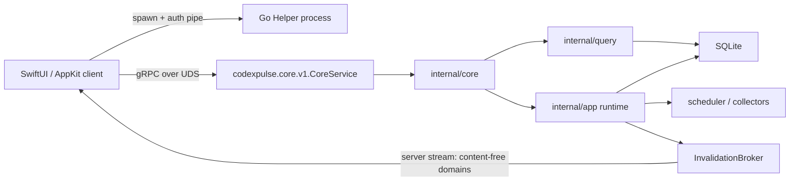
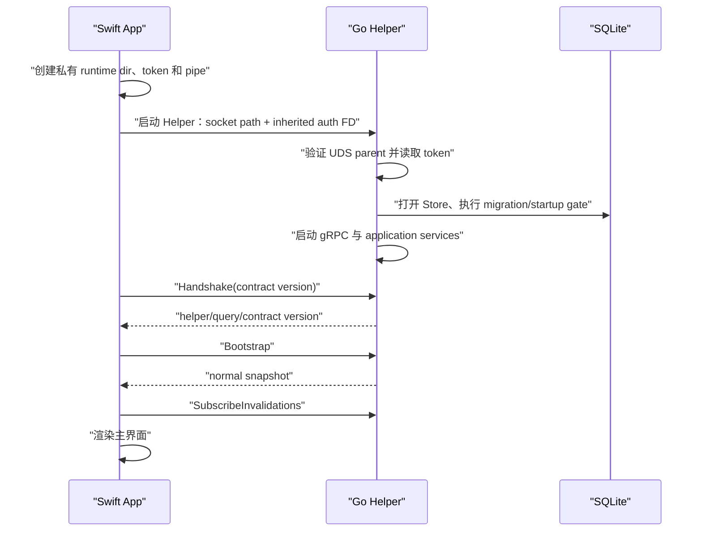

# Native macOS Client and Go Helper Refactor

## 文档定位

本文冻结 Codex Pulse 从旧 Web 桌面运行时迁移到原生 macOS 客户端的完整重构方案。它记录架构决策、职责边界、RPC 语义、进程生命周期、安全要求、实施阶段和验收门槛；不把讨论中的中间选项或时间估算冒充已完成能力。

当前仓库已经完成 Go Helper 基础层和 Swift transport：Go 进程独占业务事实和 SQLite，通过认证后的 gRPC over Unix Domain Socket 暴露 `codexpulse.core.v1.CoreService`。`TOO-313` 当前分支建立了 SwiftUI/AppKit application shell、development-only unsigned `.app`、Bundle Helper 定位和首个 Overview 真实纵向切片；`TOO-314` 当前工作树进一步接通 Sessions、Projects、Quota/Usage、Local Status/Health、Sources/Jobs、Settings 与共享 runtime，并让轻量索引提供 API 等价成本和全局按模型统计。2026-07-22 已在复用的私有 development runtime 上直接绑定真实 Codex Home，完成非零 Sessions/Projects/Usage、已知成本、模型 breakdown、详情读取和七页 render live E2E。完整 Xcode/XCTest/XCUITest、真实 system lifecycle、正式 Bundle/嵌套签名、公证、更新安装和发布切换仍是后续 gate。

相关真相入口：

- [`api/codexpulse/core/v1/core.proto`](../../../../api/codexpulse/core/v1/core.proto)：跨语言 contract 的唯一 IDL。
- [`internal/core`](../../../../internal/core)：与 transport 无关的业务 façade、映射和 invalidation。
- [`internal/helper`](../../../../internal/helper)：UDS、认证、gRPC adapter 和 Helper 生命周期。
- [Architecture](../architecture/README.md)：当前仓库运行时和模块责任边界。
- [Updates and Release](../updates-and-release/README.md)：退出、migration、签名和发布边界。

## 1. 要解决的问题

这次重构的根本目标不是单纯更换界面技术，而是建立一个长期可维护的原生 macOS 产品边界：

1. SwiftUI/AppKit 直接拥有窗口、菜单栏、Popover、导航、快捷键、可访问性和 macOS 生命周期。
2. 保留已经成熟的 Go 索引、调度、SQLite、Quota、Usage、Health 和 recovery 能力，不重写业务核心。
3. 用版本化、可生成、可测试的本机 RPC 取代旧桌面绑定层。
4. 保证 Swift 和 Go 对分页、取消、错误、未知值、部分结果和恢复状态只有一套解释。
5. 最终仍向用户交付一个 `Codex Pulse.app`，不要求用户安装、配置或管理独立服务。

如果只把页面重新画一遍，而没有解决 contract、生命周期、进程托管、安全和发布链，这次迁移就没有完成。

## 2. 冻结决策

### 2.1 一个产品、一个仓库、一个版本

Swift 客户端和 Go Helper 继续位于同一个仓库，使用同一套 Issue、CHANGELOG、tag、CI 和 Release。一次涉及业务字段的变更应在同一个变更集中完成：

```text
Proto contract
    -> Go Core mapping / Helper adapter
    -> 生成的 Go 与 Swift 类型
    -> Swift feature / view model / view
    -> contract test + Go test + Swift test
```

只有当 Go Core 将来成为多个产品共同消费、拥有独立版本和兼容周期的公共服务时，才考虑拆仓。当前 Swift 客户端与 Helper 是一个不可拆分的交付单元。

### 2.2 一个 App Bundle、两个普通用户态进程

目标产物结构：

```text
Codex Pulse.app/
└── Contents/
    ├── MacOS/
    │   └── Codex Pulse              # SwiftUI / AppKit 主程序
    ├── Helpers/
    │   └── codex-pulse              # Go Helper
    ├── Frameworks/
    │   └── ...                      # 客户端运行依赖，按实际构建结果确定
    └── Resources/
```

Apple 将普通 helper tool 的标准位置定义为 `Contents/MacOS/` 或 `Contents/Helpers/`。Helper 必须先签名，随后再签外层 App；Bundle 内代码和运行期可写数据必须分离。参考：[Placing content in a bundle](https://developer.apple.com/documentation/bundleresources/placing-content-in-a-bundle)、[Creating distribution-signed code for macOS](https://developer.apple.com/documentation/xcode/creating-distribution-signed-code-for-the-mac/)。

本项目不需要 privileged helper、root、LaunchDaemon 或安装到 Bundle 外。Helper 只在 Swift App 生命周期内运行。

### 2.3 Swift 是完整客户端，Go 是业务核心

“Swift 只是壳”会低估客户端职责。准确分工如下：

| 能力 | 唯一 owner |
| --- | --- |
| Codex 数据发现、JSONL 索引、增量游标 | Go |
| SQLite schema、migration、事务和恢复 | Go |
| Scheduler、Quota、Usage、Project、Session、Health 业务口径 | Go |
| 查询过滤、排序、分页、partial/unknown/error 语义 | Go |
| Core RPC contract 与 Go adapter | Go 仓内 contract 层 |
| Window、Sidebar、Toolbar、Table、Chart、Settings 页面 | SwiftUI |
| Menu Bar、Popover、系统菜单、快捷键、应用激活与退出交互 | AppKit / Swift |
| Helper 启动、握手、崩溃呈现、有限重启 | Swift |
| 更新检查、下载、安装、Sparkle、签名和公证 | Swift / 发布链 |
| SQLite、业务 DTO 和健康结论的直接解释 | 禁止在 Swift 重复实现 |

典型变更归属：

| 变更 | 需要修改 |
| --- | --- |
| 调整页面布局、视觉或键盘行为 | Swift |
| 增加菜单、通知或快捷键 | Swift/AppKit |
| 修改索引、额度或成本规则 | Go；若展示变化则同步 contract 与 Swift |
| 增加后端字段 | Proto + Go mapping + 生成代码 + Swift |
| 增加完整页面 | 通常同时涉及 Go contract 与 Swift feature |
| 修改 RPC 语义 | Proto、Go、Swift、contract tests 必须同批更新 |

### 2.4 采用 gRPC + Protobuf + Unix Domain Socket

首选栈：

```text
SwiftUI / AppKit
    -> grpc-swift-2
    -> grpc-swift-nio-transport
    -> grpc-swift-protobuf
    -> Unix Domain Socket
    -> grpc-go
    -> internal/core
```

选择理由：

- Protobuf 同时生成 Go 与 Swift 类型，减少双端 DTO 漂移。
- gRPC 原生覆盖 unary、server streaming、deadline、取消和状态码。
- UDS 不监听 TCP 端口，符合单机 Helper 的部署模型。
- `SubscribeInvalidations` 可直接使用 server stream，不需要另造 SSE、WebSocket 或事件 framing。
- Go handler 直接继承 RPC `context.Context`，页面取消和 deadline 可以传入查询链路。

官方组件入口：[gRPC Swift 2](https://github.com/grpc/grpc-swift-2)、[gRPC Swift NIO Transport](https://github.com/grpc/grpc-swift-nio-transport)、[gRPC Swift Protobuf](https://github.com/grpc/grpc-swift-protobuf)、[gRPC-Go](https://github.com/grpc/grpc-go)。

明确不选：

- 自研 JSON-RPC framing：需要重复实现分帧、请求匹配、取消、流和错误映射。
- Loopback HTTP + OpenAPI：可作为独立小工具的备选，但本项目已有较多 RPC、stream、recovery 和取消语义，长期 contract 收益不足以抵消双轨维护。
- Swift 直接读 SQLite 或 JSONL：会形成第二套数据和业务真相。
- Go 静态库/C ABI 进程内桥接：会引入 Go pointer、内存释放、callback、主线程和 runtime 生命周期复杂度。
- 把平台更新、Window、Tray 或 Popover 命令塞入 Core RPC：这些是 native client 职责。

## 3. 目标架构



不可破坏的不变量：

1. `core.proto` 是唯一跨进程 contract，Swift 不根据 Go struct 或 SQLite schema 自造 DTO。
2. `internal/core` 不知道 socket、Swift、窗口或 App Bundle。
3. `internal/helper` 不决定业务口径，只负责 transport、安全和进程收口。
4. SQLite 始终只有 Go runtime owner；客户端进程不得打开数据库。
5. invalidation 只提示哪些 domain 需要重查，不携带业务事实。
6. Helper 不监听 TCP，不成为常驻后台服务，也不在父进程退出后继续孤儿运行。

## 4. 仓库布局

Go Helper 已有路径保持稳定；后续 Swift 客户端建议新增独立顶层目录，不与生成的 Go 文件混放：

```text
codex-pulse/
├── api/codexpulse/core/v1/
│   ├── core.proto
│   └── core*.pb.go
├── app/macos/
│   ├── Package.swift
│   ├── Sources/
│   │   ├── CodexPulseProtocolGenerated/
│   │   ├── CodexPulseCoreClient/
│   │   ├── CodexPulseAppSupport/
│   │   └── CodexPulseApp/
│   └── Tests/
│       ├── CodexPulseCoreClientTests/
│       └── CodexPulseAppTests/
├── internal/core/
├── internal/helper/
├── internal/app/
├── internal/query/
├── internal/store/
├── main.go
└── Makefile
```

`app/macos/CoreClient` 只负责进程托管、连接、认证、生成 client 的薄封装、错误翻译、stream 重连和可观察 connection state；不得承接业务规则。

## 5. RPC contract 设计

### 5.1 版本与握手

连接建立后的第一个业务调用必须是 `Handshake`。客户端至少发送：

- `client_name`
- `client_version`
- `contract_version`

Helper 返回：

- `helper_version`
- `contract_version`
- `query_version`
- `transport=grpc+unix`

contract 不兼容时必须 fail closed，由客户端展示稳定的“核心组件版本不匹配”状态；不得继续到具体页面后才以解码错误失败。App 打包 gate 还必须读回 Swift 生成代码、Proto 和 Helper 的版本一致性。

### 5.2 RPC 分类

当前 `CoreService` 覆盖以下边界：

| 分类 | RPC |
| --- | --- |
| 握手与启动 | `Handshake`、`Bootstrap`、`Contracts` |
| 用量与主实体 | `UsageCost`、`ListSessions`、`SessionDetail`、`ListProjects`、`ProjectDetail` |
| Quota | `QuotaCurrent`、`RequestQuotaRefresh` |
| 数据源、任务与健康 | `ListSources`、`Source`、`ListJobs`、`Job`、`ListHealth`、`Health`、`HealthProjection`、`DataHealth` |
| 设置与 Home | `Settings`、`UpdateSettings`、`PlanHomeSwitch`、`ConfirmHomeSwitch`、`RecoverHomeSwitch` |
| 受控操作 | `RunRuntimeAction`、`AnalyzeSessionIndexRepair` |
| 生命周期与恢复 | `NotifyLifecycle`、`MigrationRecovery*`、`Shutdown` |
| 失效通知 | `SubscribeInvalidations` server stream |

未来新增 RPC 必须先回答：这是 Go 拥有的业务能力，还是 Swift 拥有的平台/交互能力？只有前者才能进入 `CoreService`。

### 5.3 零、缺失、unknown 和 partial

Proto3 scalar 默认值不能单独表达“未提供”和“真实为零”。contract 必须显式使用 `optional`、message 或 `oneof` 保留存在语义。

当前 `NumericValue` 的约束是：

- `value` present 且为 `0`：真实零。
- `value` absent 且 `unknown_reason` present：未知，并说明稳定原因。
- unit 独立存在，不由客户端猜测。
- `partial` 通过 response status/issues 表达，不用零值冒充完整结果。

Swift 生成类型到页面 state 的映射必须覆盖这四类情况，禁止使用 `value ?? 0` 抹平未知语义。

### 5.4 错误

错误由 gRPC status code 和 `ErrorDetail` 共同表达：

```text
validation        -> InvalidArgument
not_found         -> NotFound
partial           -> FailedPrecondition
unavailable       -> Unavailable
cancelled         -> Canceled
deadline_exceeded -> DeadlineExceeded
其他未分类错误     -> Internal
```

`ErrorDetail` 只包含 allowlisted `code`、`message_key`、可选 `field` 和 `retryable`。底层 Go error、SQL、绝对路径、token、HTTP body、panic payload 和用户内容不得跨 RPC。

Swift 根据 `message_key` 使用本地资源映射文案；未知 code 必须进入通用安全错误，不展示 transport 原文。

### 5.5 取消、deadline 与幂等

- Swift 页面离开、筛选变化或 Task 取消时，应取消对应 gRPC call。
- Go handler 必须把 RPC context 原样传到 Core/Query，不创建脱离 caller 的无界后台查询。
- 有副作用的 RPC 必须继续使用既有 revision、confirmation token、request ID 或 durable fence；不能把 gRPC retry 当作业务幂等。
- Swift 只可对明确幂等的只读 RPC 做有界重试；mutation 在结果不确定时必须读回权威状态。
- deadline 是调用方等待上限，不代表后台事务必然没有提交。

### 5.6 分页和消息大小

- 列表继续使用 opaque cursor 和服务端限制，不允许客户端解析 cursor。
- 页面应请求聚合 DTO 和有界 page，不做逐行 RPC。
- Helper 当前限制单条 gRPC message 最大 16 MiB；未来调整必须同时提供内存、延迟和大响应测试证据。
- 任何“为了省 RPC 次数”而返回无界 Session、Turn 或趋势数组的改动都应被拒绝。

### 5.7 Invalidation stream

`SubscribeInvalidations` 只发送 version、sequence、domain 列表和时间，不发送最新业务数据。

```text
Go commit / lifecycle change
    -> InvalidationBroker
    -> server stream(domain = quota | health | sessions | ...)
    -> Swift cache 标记 stale
    -> 对应页面重新调用权威 query
```

事件允许重复、合并和丢失后的全量重查。Swift 必须处理 stream 断开、App sleep/wake、Helper 重启和 sequence gap；不能把 stream 当事件溯源日志。

## 6. 本机安全模型

### 6.1 UDS 目录和 socket

Swift 创建短、随机且私有的运行目录，例如：

```text
/tmp/cp-<uid>-<random>/core.sock
```

必须满足：

- 路径为绝对路径，并控制在 Unix socket path 长度限制内。
- 父目录由当前 UID 拥有、权限 `0700`、不是 symlink。
- 不信任或复用已有同名目录。
- Helper 创建 socket 后读回类型和权限为 `0600`。
- Helper 退出时删除 socket；异常遗留只在重新验证 owner、mode、type 后清理。

### 6.2 一次性认证 token

- Swift 每次启动 Helper 生成新的高熵 token。
- token 通过专用继承 pipe 传递，不进入 argv、环境变量、文件、数据库或日志。
- Helper 读取首行后只保留 SHA-256 摘要，并清除原始 byte buffer。
- unary 和 stream 使用同一 Bearer metadata 认证策略。
- token 只用于本次父子进程会话，不持久化、不刷新、不跨重启复用。

### 6.3 进程与日志

- Helper stdout/stderr 只允许 content-free 运行信息，不可输出请求或响应体。
- Swift 不记录 gRPC metadata、token、绝对 Home 路径或原始 payload。
- 正式包可进一步评估 Apple launch constraints，将 Helper 限制为只允许匹配签名的父 App 启动；这是发布硬化项，不替代 UDS/token 认证。

## 7. 启动、运行与退出生命周期

### 7.1 正常启动



Swift 可以立即显示原生 loading shell，但不得在 `Handshake + Bootstrap` 完成前伪造业务可用状态。

### 7.2 Migration recovery 启动

migration failure 时 Helper 关闭普通 Store 图，只启动 recovery-only 能力。`Bootstrap` 返回 recovery mode，Swift 必须进入专用恢复界面，只允许：

- 读取稳定 recovery state。
- retry。
- prepare/confirm/cancel restore。
- exit。

成功恢复返回 `restart_required`；Swift 终止旧 Helper、重新创建 runtime dir/token 并启动新 Helper。不得在同一进程内热装配 normal graph。

### 7.3 前后台与睡眠

Swift 通过 `NotifyLifecycle` 发送有限枚举：foreground、background、sleep、wake 等。未知字符串在双方都 fail closed。lifecycle notification 只驱动 Go 已有调度策略，不携带窗口结构或页面路由。

wake/foreground 后 Swift 应：

1. 检查 gRPC channel/Helper process 状态。
2. 恢复 invalidation stream。
3. 对当前可见 domain 做权威重查。
4. 不依赖睡眠期间累计的每个 stream event。

### 7.4 正常退出

```text
Swift 停止新的 UI mutation
    -> Shutdown(reason = client_exit | client_restart)
    -> Shutdown 返回 accepted
    -> gRPC graceful stop，停止新调用并等待已接纳 RPC
    -> scheduler / lifecycle / health / metrics / retention drain
    -> SQLite writer 与 read pool close
    -> UDS cleanup
    -> Helper exit
    -> Swift exit 或安装更新
```

Swift 只能在 Helper 已确认退出后替换 Helper/App 二进制。超时意味着结果不确定，客户端不得显示“安全退出完成”。

### 7.5 父进程崩溃与 Helper 崩溃

- Swift 崩溃或被强制终止：auth pipe EOF 触发 Helper 有界 graceful stop 和 application drain。
- Helper 异常退出：Swift 进入明确的 core unavailable 状态，取消 in-flight calls，不沿用旧 cache 冒充新鲜数据。
- 自动重启必须有有限次数和退避，并区分 startup/migration failure 与意外 crash；不能形成无限 crash loop。
- 重启后必须重新生成 token、重新握手、Bootstrap 并重建 invalidation stream。

## 8. Swift 客户端设计原则

Swift 建议使用 actor 或等价的串行隔离对象管理 Helper process 和 gRPC channel。页面只能依赖面向 feature 的 protocol，不接触 socket、metadata 或生成 client 细节。

客户端至少公开以下 connection state：

```text
idle
starting
handshaking
normal
recovery
restarting
unavailable
shutting_down
```

每个页面需要显式覆盖：

- loading
- ready
- empty
- partial
- stale/last-known-good
- unavailable
- cancelled
- recovery-blocked

Swift cache 只用于展示连续性，不成为权威事实。任何 mutation 成功后都应通过 receipt + invalidation/readback 收敛到 Go 状态。

## 9. 更新、签名和发布边界

Swift/AppKit 是更新和 App 生命周期 owner。Go Helper 不提供检查、下载、安装、跳过或延后更新的 RPC。

发布顺序：

```text
生成并验证 Proto/Swift client
    -> Go test + Swift test
    -> 构建 release Helper
    -> 将 Helper 放入标准 Bundle code location
    -> 签名 Helper / nested frameworks
    -> 签名外层 App
    -> archive / notarization / staple
    -> 更新产物签名和发布读回
```

Bundle 是只读签名结构。SQLite、preferences、socket、日志和缓存必须写到标准可写目录，任何运行期写 Bundle 的行为都应 fail closed。

更新安装前必须先完成正常 `Shutdown` handshake。安装失败、Helper 未退出、签名或 notarization 缺失都不能被降级为 warning 后继续发布。

## 10. 实施路线

原讨论采用逐层验证、再纵向迁移的思路。当前 Go Helper 已先行完成，因此后续计划按实际状态重排：

### 阶段 A：Go Core 与 Helper 基础层（已完成）

- `codexpulse.core.v1` Protobuf contract。
- transport-independent `internal/core.Service`。
- grpc-go UDS server。
- auth pipe、token digest、unary/stream interceptor。
- typed error、optional/unknown/partial mapping。
- business、settings、Home switch、runtime action、repair、recovery RPC。
- invalidation stream、lifecycle 和 shutdown。
- Proto drift、Helper build、race/vet 和单元测试 gate。

该阶段不等于原生 App 已完成。

### 阶段 B：Swift transport spike

目标是在不写完整页面前证明跨语言边界成立：

1. 从同一 Proto 生成 Swift client。
2. Swift 通过 UDS 完成 `Handshake` 和 `Bootstrap`。
3. 验证真实零、unknown、partial 和 `ErrorDetail` 映射。
4. Swift Task 取消能够使 Go context 取消。
5. invalidation server stream 可重连，并正确处理 sleep/wake。
6. 验证 recovery Bootstrap 和 `restart_required`。

必须读回：冷启动握手时间、unary RPC p50/p95、空闲总 RSS、包体增量、stream 重连时间和 Helper 异常退出恢复时间。

### 阶段 C：原生应用骨架和首个纵向切片（TOO-313 当前分支已实现当前工具链闭环）

- `NSApplication` / SwiftUI App lifecycle。
- `NavigationSplitView`、Sidebar、Toolbar。
- Menu Bar Item 和原生 Popover。
- CoreClient connection state 和全局错误 surface。
- Overview 真实接入 `Bootstrap`、`UsageCost`、`QuotaCurrent`、`ListSessions`、`HealthProjection`。
- 深浅色、键盘焦点、Reduce Transparency 和 VoiceOver 基础验证。

fixture 只用于 Preview/单元测试，不能用静态数据宣布 transport 或产品切片完成。

`TOO-313` 的实际交付边界：

- `NSApplication`/`NSWindow` + SwiftUI `NavigationSplitView`/Toolbar，`NSStatusItem` + `NSPopover`。
- 主窗口与 Popover 观察同一 `AppModel`，不建立第二套 cache。
- `AppRuntime` 复用 `HelperSupervisor`、`CoreClient` 和 `InvalidationStreamController`，用 process exit source 与 stream terminal callback 感知运行期失效，显式暴露 starting/handshaking/loading/normal/partial/recovery/restart-required/stale/unavailable/shutdown 状态。
- Overview 通过生成 client 真实调用 `Bootstrap`、`UsageCost`、`QuotaCurrent`、`ListSessions`、`HealthProjection`；生成 response 仍是 contract truth，Swift 只生成 presentation state。
- development-only unsigned `.app` 使用 `Contents/MacOS` 和 `Contents/Helpers`，隔离 UI smoke 真实读回 window/status item/popover、Overview 和 `shutdown=clean`；RPC/runtime/shell deadline 防止退出 gate 无限挂起，forced/uncertain 不算通过。
- 当前 Command Line Tools 不提供 `xcodebuild`/XCTest/UI automation；真实 system sleep/wake、accessibility 自动化、签名、公证和发布不在本卡完成证据内。测试真相见 [`docs/test/native-app-shell-overview.md`](../../../test/native-app-shell-overview.md)。

### 阶段 D：主要日常页面（TOO-314 当前工作树已实现当前工具链闭环）

按依赖和用户价值迁移：

1. Sessions 列表与详情。
2. Projects 列表、趋势与详情。
3. Quota 与手动刷新。
4. Local Status 与 Data Health。
5. Sources 与 Jobs 的诊断入口。

每个切片必须同时完成：contract 使用、ViewModel/View、分页、取消、partial/error、invalidation、Swift 单元测试和 UI smoke。

`TOO-314` 的实现边界：

- 七个原生导航入口共享同一 `AppModel`、runtime/connection truth、Toolbar 刷新和 stale/unavailable/restart surface；主窗口、Status Item 与 Popover 不复制 cache。
- Sessions、Projects、Sources、Jobs、Health list/detail 只消费生成的 response；opaque cursor、cursor history、筛选、选择和 load-more 使用 Task cancellation + feature/runtime generation，旧请求不能覆盖新状态，重复 cursor 会终止分页。
- Project detail 的 sessions/models 使用两个独立 cursor；Swift 只稳定合并 provider page，不重算 project/model 业务归因。
- Quota/Usage 保留 zero、unknown reason、partial、source freshness、unpriced/degraded；手动刷新只允许 `quota|reset_credits`，receipt 后权威刷新。
- Health/Data Health 区分 provider 业务状态和 transport connection；provider recovery command key 只读展示，不映射为另一套 RPC。独立的全局调度控制只允许 `pause_backfill|pause_all|resume|reconcile`，用户确认后消费生成 receipt 并刷新事实。
- Settings 读取 editable metadata，以 authoritative revision 做 CAS；成功与结果不确定都 readback，revision 不一致显式呈现 conflict 并保留用户草稿，`applied_reconcile_required` 不写成普通成功，未知 receipt result fail closed。
- Home switch、repair、正式 migration/release 保持禁用说明，不用 mock 冒充可执行能力。
- 确定性 isolated App/Helper smoke 会让 RootView 依次消费七个共享 route、查询所有主要页面，并在隔离 preferences 上验证 Settings mutation、receipt/readback、stale revision conflict 和原值恢复。它继续作为 CI/contract regression，不冒充真实数据产品验收。
- 本机 live App/Helper smoke 复用已配置私有 runtime，把 App Server 子进程的 `CODEX_HOME` 固定为 confirmed 真实 Home，允许正常状态库、WAL、锁和日志写入；提交版只记录非零计数、稳定状态和 clean Shutdown，不记录用户内容、名称、真实路径或原始日志。该 render marker仍不冒充 XCUITest/视觉断言。
- 测试真相见 [`docs/test/native-primary-pages.md`](../../../test/native-primary-pages.md)。

### 阶段 E：高风险系统流程（仅安全 Settings/运行时动作子集进入 TOO-314）

- Settings revision conflict。
- Codex Home plan/confirm/recovery。
- Migration recovery 专用启动面。
- Session index repair dry-run。
- foreground/background、sleep/wake。
- Helper crash/restart、App reopen、Cmd-W、Cmd-Q。
- 更新检查、下载、safe shutdown、安装和重启。

这些不是“最后再补”的可选 polish，而是正式切换硬门槛。

### 阶段 F：Bundle、发布和切换

- Helper 嵌入、架构、权限和嵌套签名读回。
- Xcode archive、Developer ID、hardened runtime、notarization、staple。
- production Application Support/SQLite 兼容性。
- N-1、migration failure、恢复、升级和回滚矩阵。
- 真实只读 Codex Home E2E、隐私审计、性能与能耗基线。
- 明确可回滚的最后旧版 tag/commit；当前分支不再保留并行旧 UI runtime，回退依赖版本控制与发布策略，而不是两个进程同时打开同一生产库。

## 11. 性能模型和验收指标

相较纯 Swift 单进程，Helper 架构会增加第二进程、Go runtime、IPC 编解码和握手成本；相较旧 Web 桌面运行时，它去掉了浏览器渲染与脚本运行组件，整体资源不一定更高。任何结论都必须由真实产物测量。

关键原则：

- UI 渲染、动画和滚动全部在 Swift 进程内完成，不做逐帧 RPC。
- 页面一次请求有界聚合 DTO，不按列表行发 RPC。
- Helper 常驻 App 生命周期，不在页面切换时重复启动。
- 先显示 native loading shell，不伪装业务 ready。

需要建立的基线：

| 指标 | 对比对象 |
| --- | --- |
| App launch 到窗口可交互 | Swift shell、Handshake、Bootstrap 分段 |
| Helper 冷启动和 migration | 空库、现有库、recovery 三态 |
| unary RPC p50/p95/p99 | 纯 transport 与包含查询分别记录 |
| Swift + Helper idle RSS | 关闭窗口、Overview、Popover 三态 |
| 索引期间 peak RSS/CPU | 与 Go-only 基线比较 |
| idle CPU、wakeups、Energy Impact | 前台、后台、睡眠恢复 |
| stream 断线恢复 | 正常断线、sleep/wake、Helper restart |
| Helper crash UI 恢复时间 | unavailable 到重新 Bootstrap |
| App/ZIP size | Helper、Swift 依赖、符号剥离后读回 |

初期 spike 只定义测量方法和预算，不在没有实测前写死“性能无损”。

## 12. 风险与防护

### 12.1 Contract 漂移

风险：Swift 使用旧生成代码，直到运行时才失败。

防护：固定 generator、临时目录重生成比较、禁止手改生成文件、Handshake 版本检查、App bundle 读回。

### 12.2 真实零被抹成 unknown 或反过来

风险：Proto scalar 默认值、Swift optional 映射或 UI fallback 破坏业务语义。

防护：golden contract tests 覆盖 zero/absent/unknown/partial，每个 feature 禁止 `?? 0` 式兜底。

### 12.3 Helper 退出不干净

风险：孤儿进程、SQLite 未 drain、更新替换正在使用的二进制。

防护：显式 Shutdown、父 pipe EOF、有限 graceful stop、进程退出读回、crash/force-quit 测试。

### 12.4 两个产品进程同时拥有生产数据库

风险：开发版、旧版和原生版同时打开同一 Store。

防护：开发/测试使用独立 Application Support；正式切换只允许一个 runtime owner；单实例和数据库 owner 需要 live E2E。

### 12.5 只完成漂亮页面，遗漏 recovery/update

风险：正常路径演示可用，但 migration failure、退出和升级不可交付。

防护：阶段 E/F 是发布 blocking，未完成不得接管正式 Bundle ID。

### 12.6 Swift 重复业务规则

风险：Quota、Health、分页或错误判断在双端逐渐分叉。

防护：Swift 只解释稳定 enum/DTO；所有计算与仲裁留在 Go；Review 检查客户端是否直接读取数据库或推导权威状态。

### 12.7 无限自动重启

风险：Helper startup failure 形成 crash loop、CPU/日志风暴或掩盖 migration recovery。

防护：有限次数、退避、稳定 crash classification、显式用户恢复入口。

## 13. 验证与 Review 策略

### 当前 Go Helper gate

```bash
make verify
```

覆盖 harness、project rules、Proto drift、Go race、vet 和 Helper build。它不证明 Swift client、App Bundle、签名、公证或 live E2E。

### Swift/集成 gate

至少增加：

- Swift package/Xcode build。
- Proto Swift generation drift。
- CoreClient 单元测试和 fake Helper contract tests。
- 真实 Go Helper transport integration tests。
- xcodebuild unit/UI smoke。
- Bundle layout、Mach-O architecture、签名和 notarization readback。
- helper crash、parent crash、shutdown timeout、sleep/wake 和 recovery E2E。
- 真实只读 Codex Home 的隐私与性能验证。

当前已落地 `make verify-swift-app`、`make verify-swift-app-smoke-isolated`、`make verify-swift-app-live`、`make verify-swift-app-smoke` 与 `make verify-swift-primary-pages`。前两类覆盖 SwiftPM App build、确定性 typed invalidation/state/lifecycle/pagination/CAS/single-flight、development Bundle layout 和 CI-safe 隔离 route/render；后三个本机入口复用已配置 runtime，直接验证真实 Home 的非零 Sessions/Projects/Usage、详情读取和七页 route/render。`xcodebuild` UI test、视觉断言、正式 Bundle/signing/notarization 与真实 system lifecycle 仍必须按后续阶段补证，不能由当前 smoke 替代。

实现可按纵向切片提交，但架构切换前做一次覆盖完整 scope 的整体 Review，重点攻击：

1. Swift 是否重新定义 Go 业务事实。
2. contract 是否丢失 zero/unknown/partial/error 语义。
3. Helper 是否可能泄漏 token、路径或 payload。
4. shutdown/crash/recovery 是否存在双 owner 或未提交事务风险。
5. package/sign/notarization 证据是否来自真实产物。

## 14. 正式切换验收条件

只有以下条件全部满足，原生 App 才能作为正式 Codex Pulse 交付：

- Swift 与 Go 使用同一份 Proto，生成代码无 drift，Handshake 版本一致。
- 正常启动和 migration recovery 启动都可用。
- 所有仍在产品范围内的 Core RPC 都有 native client 入口或明确不展示理由。
- Sessions、Projects、Quota、Settings、Health 的分页、取消、partial 和错误语义对齐。
- Home switch、repair dry-run、lifecycle 和 shutdown 完整闭环。
- Helper crash/parent crash 不产生 SQLite 损坏、孤儿进程或无限重启。
- invalidation stream 在断线、sleep/wake 和 Helper 重启后收敛到权威查询。
- Swift App + Go Helper 完成真实嵌套签名、archive、notarization 和产物读回。
- Go、Swift、contract、UI smoke、隐私、性能、N-1 和 recovery 矩阵通过。
- 使用真实只读 Codex Home 完成一次脱敏 live E2E。
- 有明确的旧版本回滚入口，且回滚不会错误假设 schema 可自动降级。

## 15. 工期理解

讨论阶段的单人全职粗估是：

| 结果 | 规划量级 |
| --- | ---: |
| transport spike + 原生 Overview/Popover | 2～3 周 |
| 可日常使用的 native beta | 6～8 周 |
| 主要正常页面对齐 | 8～12 周 |
| recovery、updater、生命周期完整对齐 | 12～16 周 |
| 达到当前项目完整验证和产品打磨标准 | 约 4～6 个月 |

这些数字只用于资源规划，不是交付承诺。Go Helper 阶段已经完成会减少后续 Core 抽离工作，但 Swift 工程、页面、系统流程、签名发布和 live E2E 仍需按真实任务重新估算。

## 16. 决策摘要

最终方向固定为：

```text
同一仓库、同一版本、一个 App Bundle
SwiftUI/AppKit 主程序 + Go Helper 两个用户态进程
gRPC Swift 2 + grpc-go + Protobuf + Unix Domain Socket
Go 独占业务事实和 SQLite
Swift 独占原生界面、平台生命周期和更新
typed contract + auth pipe + content-free invalidation
以 recovery、shutdown、签名和真实 E2E 作为切换硬门槛
```

这套边界的价值不是省掉所有重写工作，而是在获得原生 macOS 体验的同时，保留经过验证的 Go 业务核心，并让后续每个功能都能沿同一 contract 清晰演进。
