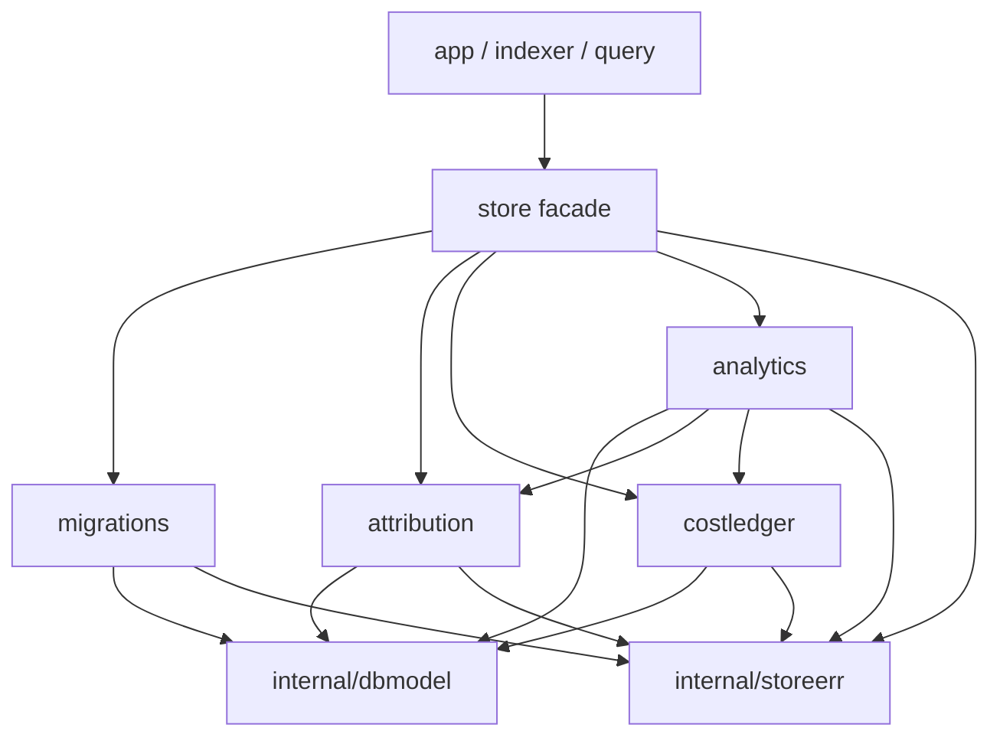

# Go Package Boundary Refactor Design

## Status

等待书面设计确认；确认前不开始生产代码重构。

## Context

本设计基于 `main` 的
`3547b2041e0d838e7e0f41fe4c08cd341e874ca6`。当前 Go 目录中：

- `internal/store`：86 个生产文件、54 个测试文件、约 26,946 行生产代码；
- `internal/app`：19 个生产文件、14 个测试文件；
- `internal/codex/logs`：11 个生产文件、11 个测试文件；
- `internal/scheduler`：10 个生产文件、8 个测试文件；
- `internal/codex/quota`：9 个生产文件、6 个测试文件。

文件数本身不是唯一问题。`internal/store` 同时承担了：

- SQLite 生命周期和 writer queue；
- 52 个左右的 GORM 持久化/扫描模型；
- 19 个 append-only migration 及其 schema 校验；
- attribution 派生与回填；
- cost ledger 重建；
- analytics 查询；
- ingest、runtime、scheduler、quota 等其他持久化行为。

其中有三条必须保留的耦合：

1. `WriteUnit` 在事实写入和 quota projection flush 后，必须在同一个
   `*gorm.DB` transaction 中刷新 attribution。
2. Migration V4/V18 必须在 migration transaction 中重算 attribution。
3. Migration V11 必须在 migration transaction 中重建 quota projection。

因此不能只移动文件或让新子包反向 import `store`；那会造成循环依赖，或者把原子事务
拆成多个 transaction。

## Goals

在 `refactor/go-package-boundaries` 分支中完成以下行为保持型拆包：

1. `internal/codex/logs/rollout`：rollout 内容解析；
2. `internal/app/migrationrecovery`：migration recovery 状态机和数据库交换；
3. `internal/store/internal/dbmodel`：Store 私有的 table-backed GORM 模型；
4. `internal/store/migrations`：schema、migration catalog、runner、backup 和校验；
5. `internal/store/attribution`：attribution 读写、重算和 transaction 内刷新；
6. `internal/store/costledger`：cost ledger 重建和读取；
7. `internal/store/analytics`：usage/session/project analytics 查询。

`internal/store` 根包继续作为现有调用方看到的稳定门面，保留 `Repository` 和当前
Store contract。目标不是重新设计业务 API，而是让实现边界与目录边界一致。

预计完成后 `internal/store` 根目录生产文件降至约 50 个、生产代码降至约
18,000 行以内。最终数字以实现后的 `find`/`wc` 结果为准，不通过合并无关文件凑指标。

## Non-goals

- 不修改 SQLite table、column、index、constraint 或 `PRAGMA user_version`。
- 不新增 migration 版本，不修改既有 migration checksum。
- 不修改 parser 输出、checkpoint、diagnostic、limits 或事件顺序。
- 不修改 migration recovery phase、确认语义、审计内容、备份校验或 atomic swap。
- 不拆 `runtime`、`ingest`、`scheduler`、`quota`、`bootstrap`、`metrics` 的
  repository 行为；只允许为 `dbmodel` 和 migration hook 更新其实现引用。
- 不改变 RPC/protobuf、Swift contract、JSON 字段或跨进程错误映射。
- 不把 raw `*gorm.DB` 或 `storesqlite.Store` 暴露给 Store 根包之外的业务调用方。
- 不在本分支顺带做 SQL、查询策略或领域模型优化。

## Considered approaches

### A. 只拆 logs 和 migration recovery

优点是风险最低，但没有处理文件最多的 `internal/store`，不能满足本次扩大的范围。

### B. 直接把 Store 文件按领域移入子包

该方案会立即遇到循环依赖：

- analytics 需要 cost 和 attribution contract；
- migration 需要 attribution/quota 的 transaction 内回填；
- attribution 当前需要 `Repository`、根包错误和根包 GORM model；
- `WriteUnit` 需要调用 attribution 私有 writer。

如果子包 import 根 `store`，同时根 `store` 再 import 子包，Go 无法编译。如果通过
重新开启 transaction 绕开引用，则会破坏 rollback 和原子性。

### C. 叶子模型 + 根门面 + transaction hook

先抽取不依赖根 `store` 的私有叶子包，再让各领域实现只依赖叶子包。根
`Repository` 以薄方法转发调用，并用 type alias 保持现有 contract。Migration
通过显式 hook 在自己的 transaction 中调用 attribution 和 quota 回填。

代价是需要一轮机械的 GORM model 引用更新，并保留少量门面文件；收益是依赖图可证明
无环、现有调用方几乎不变、每个阶段可单独验证和回退。

### Decision

采用方案 C，并按本设计的交付顺序逐步落地。每个阶段通过 focused tests 后才进入
下一阶段。

## Target dependency graph



约束：

- `dbmodel` 和 `storeerr` 不 import `store` 或任何 Store 领域子包；
- `migrations`、`attribution`、`costledger`、`analytics` 不 import 根
  `internal/store`；
- Store 子包只由 `internal/store` tree 使用，其他业务包继续 import 根
  `internal/store`；
- `analytics` 可以依赖 attribution/costledger 的 contract，反向依赖禁止。

## Package design

### `internal/codex/logs/rollout`

新包完整拥有内容解析流水线：

- line framing；
- duplicate-key-safe JSON decoding；
- rollout record decoding；
- turn lifecycle normalization；
- parser seed 校验和 checkpoint continuation；
- parser facts、diagnostics、counters、parse result。

移动生产文件：

- `decoder.go`
- `framer.go`
- `lifecycle.go`
- `parser.go`
- `parser_types.go`

移动对应测试：

- `decoder_test.go`
- `framer_test.go`
- `lifecycle_test.go`
- `parser_test.go`
- `parser_fuzz_test.go`
- `quota_test.go`

父包 `internal/codex/logs` 继续拥有 Home probing、file discovery、snapshot
reading、source fingerprinting 和 reconciliation。

`logs.SourceKind` 及现有常量留在父包，因为 discovery 与 rollout parser 都使用
该分类。依赖方向固定为 `logs/rollout -> logs`，父包不得 import 子包。
`internal/indexer` 等 parser 消费方同时按职责 import 两个包。

不在父包保留 parser alias；这是纯内部路径，直接更新调用方和文档。

### `internal/app/migrationrecovery`

新包拥有：

- migration recovery controller state；
- backup enumeration 和 validation；
- retry、prepare、confirm、cancel、exit transition；
- content-free audit persistence；
- ready database verification；
- 平台相关 atomic SQLite database exchange。

移动生产文件：

- `migration_recovery.go`
- `migration_swap_darwin.go`
- `migration_swap_linux.go`
- `migration_swap_other.go`

`migration_recovery_test.go` 随 controller 移动。

`migration_recovery_service.go` 和对应测试留在 `app`，作为
`core.MigrationRecoveryService` 的应用层 adapter；它继续负责
`publicRuntimeCommandFailure` 映射。

子包导出 controller、既有 snapshot/receipt/confirmation/phase/error contract，
以及 app adapter 和 startup composition 实际需要的方法。子包不得 import
`internal/app`。

### `internal/store/internal/storeerr`

这是 Store 实现共享的最小错误叶子包，拥有现有三个 sentinel：

- invalid repository；
- invalid record；
- not found。

同时提供包装 invalid-record message 的 helper。根 `store` 以变量 alias/赋值复用
同一个 sentinel，确保所有现有 `errors.Is` 行为不变。

领域专属错误仍归各领域包所有，并由根门面复用同一个 error value。例如
analytics unavailable 不进入共享错误包。

### `internal/store/internal/dbmodel`

该包只描述 SQLite persistence adapter，不承载业务方法、validation 或 repository
行为。类型和字段为供 Store 子包使用而导出，但二级 `internal` 保证 Store tree
之外不能直接 import。

迁入的内容：

- `models.go` 中的 core/runtime/pricing table models；
- `*_models.go` 中的 table-backed models；
- `light_index.go`、`light_token_store.go` 中的 table-backed models；
- `migration.go` 中的 schema migration ledger model；
- cost ledger 共享的持久化 embedded row shape。

不迁入：

- analytics/cost 查询的临时 scan projection；
- domain record；
- model/domain conversion function；
- validation、query 或 write function。

命名采用 `dbmodel.Project`、`dbmodel.Session`、`dbmodel.Turn` 等包限定名，避免
`dbmodel.ProjectModel` 的重复语义。`TableName()` 和所有 GORM tag 原样保留。

`metrics_models.go` 当前混有 conversion function；其中 table struct 移入
`dbmodel`，转换逻辑留在根包并改为引用 `dbmodel.AppRuntimeSample`。

该阶段是大范围机械改名，但不改变 SQL。所有 Store 包必须编译后才进入 migration
移动。

### `internal/store/migrations`

新包拥有：

- schema object 定义、canonicalization 和精确校验；
- V1–V19 append-only migration catalog 和 checksum；
- migration state inspection、runner、progress 和 failure；
- pre-migration space check、online backup；
- upgrade E2E catalog；
- schema/migration 专属测试。

移动实现来源：

- `schema.go` 中除根 `Repository` 门面外的实现；
- 所有 `*_schema.go`；
- `migration.go`
- `migration_backup.go`
- `migration_catalog_default.go`
- `migration_catalog_upgrade_e2e.go`
- `migration_status.go`

根包保留薄方法：

- `Repository.EnsureCoreSchema`
- `Repository.EnsureApplicationSchema`
- `Repository.MigrateApplicationSchema`
- E2E upgrade 需要的现有入口

根包对 `MigrationReport`、`MigrationProgress`、`MigrationFailure`、stage/code
常量和 sentinel errors 使用 type/value alias，保证 `app/migrationrecovery` 等
调用方不改 contract。

Migration runner 接收显式依赖：

```go
type Hooks struct {
    RecomputeAttributions  func(context.Context, *gorm.DB, *int64) (int, error)
    RebuildQuotaProjection func(context.Context, *gorm.DB, int64) error
}
```

签名可在实现时按 Go 格式微调，但语义固定：

- hook 使用 runner 已持有的 transaction；
- hook 不得调用 `Store.Write`、commit 或 rollback；
- quota hook 显式接收 migration 的 trusted `appliedAtMS`，不跨包共享私有
  context key；
- nil/缺失 required hook 必须 fail closed；
- V4/V18 调 attribution hook，V11 调 quota hook；
- V18 的 cost generation invalidation 直接使用 `dbmodel`，不调用 cost
  repository。

所有 DDL 字符串、catalog 顺序和 checksum 输入保持 byte-for-byte 等价。该拆包不
产生 V20。

### `internal/store/attribution`

新包拥有：

- session/turn attribution record contract；
- session/turn typed read；
- full recompute；
- project root resolution 和 registration；
- session/turn attribution persistence；
- transaction 内 dirty-session refresh。

移动：

- `attribution_records.go`
- `attribution_repository.go`
- 对应 repository tests

GORM rows 来自 `dbmodel`，schema 仍由 `migrations` 拥有。为避免与
`internal/attribution` 领域规则包混淆，代码中将后者 import 为
`attributiondomain`。

根 `Repository` 保留现有方法并转发到子包，根 `store` 对 attribution record、
enum 和 sentinel 使用 alias。

`WriteUnit` 继续：

1. 写入 core facts；
2. flush quota projections；
3. 对 session ID 排序；
4. 调用 attribution 子包的 transaction API；
5. 由同一个 outer transaction 决定 commit/rollback。

迁移 runner 使用同一个 transaction API 的 full-recompute 入口。子包不得自行
开启 writer transaction。

### `internal/store/costledger`

新包拥有：

- cost ledger request/report/snapshot contract；
- active generation 读取；
- final turn pricing；
- generation rebuild、reconciliation 和 rollback-safe publish；
- rollup aggregation。

移动：

- `cost_records.go`
- `cost_repository.go`
- `cost_repository_test.go`

GORM rows 来自 `dbmodel`，DDL 由 `migrations` 拥有。根 `Repository` 保留
`RebuildCostLedger` 和 `ActiveCostLedger` 等现有方法，根 `store` 对 records、
enum、constants 使用 alias。

重建仍通过应用唯一 writer queue 执行；不把 transaction 所有权交给业务调用方。

### `internal/store/analytics`

新包拥有 usage range、session list/detail、project list/detail 的全部读实现和
read contract。

移动所有 `analytics_query*.go` 和对应 tests，包括：

- light-index fallback；
- active-rollup 和 detail fallback；
- session timeline；
- project drilldown；
- filter/cursor validation；
- read-model mapping 和 reconciliation。

子包依赖：

- `dbmodel` 的持久化 row；
- attribution 的安全 dimension contract；
- costledger 的 generation、rollup 和 cost contract；
- `storesqlite` 的 read snapshot。

根 `Repository` 保留：

- `UsageCostRange`
- `ListSessionAnalytics`
- `SessionAnalytics`
- `ListProjectAnalytics`
- `ProjectAnalytics`

根 `store` 对所有 analytics filter/cursor/page/snapshot/enum 和
`ErrAnalyticsUnavailable` 使用 alias。这样 `internal/query/usagecost` 无需切换
import path，也不会感知实现拆分。

现有文档中的文件路径门禁会同步更新到新目录，不能为了通过检查删除 SQL 安全或隐私
断言。

## Transaction and lifecycle contract

`storesqlite.Store` 仍由根 `store.Repository` 绑定，根门面把已绑定 Store 传给
领域实现。调用方不能从 `Repository` 取出 raw database。

- read API 继续使用 `Store.View`，一个返回值必须来自同一个 read snapshot；
- standalone write API 继续使用 `Store.Write`；
- `WriteUnit` 和 migration hook 只接收当前 `*gorm.DB`，禁止嵌套写队列；
- callback 返回后 `WriteUnit` 立即失效；
- error 任一处返回时，由现有 outer transaction 整体 rollback；
- attribution refresh 的排序和执行时机保持不变。

## Compatibility contract

以下保持不变：

- 根 `store.Repository` 方法签名；
- 根 `store` 中业务调用方已经使用的 exported types/constants/errors；
- `errors.Is` 和 migration failure unwrap；
- parser/recovery error text；
- SQLite schema、migration history、checksum、backup naming；
- JSON/RPC/Swift contract；
- content-free 和 path/privacy guarantees。

根门面不是临时兼容垃圾层，而是 Store 对其他模块的稳定端口。子包导出的实现 API
只服务根门面和 Store tree，不成为新的应用层 contract。

## Test strategy

这是结构重构，现有 behavior tests 是主要 characterization contract。每个阶段：

1. 先移动或新增目标包测试，运行并观察预期的 compile failure；
2. 移动最小生产实现并修复 package-qualified reference；
3. 运行目标包 focused tests；
4. 运行根 Store 和直接依赖包测试；
5. `git diff --check` 后单独 commit。

Focused verification：

```bash
CGO_ENABLED=0 go test ./internal/codex/logs ./internal/codex/logs/rollout ./internal/indexer -count=1
CGO_ENABLED=0 go test ./internal/app ./internal/app/migrationrecovery ./internal/core ./internal/helper -count=1
CGO_ENABLED=0 go test ./internal/store/... -count=1
CGO_ENABLED=0 go test ./internal/query/usagecost ./internal/indexer ./internal/app -count=1
```

Store 拆分后额外验证：

- frozen migration checksum tests；
- fresh DB、legacy DB、失败 rollback、backup/restore tests；
- attribution write-unit rollback 和 dirty-session once-only tests；
- cost generation idempotency/rollback/restart tests；
- analytics active/light/detail 三种 read mode、pagination 和 privacy tests；
- 架构检查禁止 Store 外部直接 import 实现子包；
- 文档中 GORM/SQL 边界检查指向移动后的文件。

Repository verification：

```bash
CGO_ENABLED=0 go test ./... -count=1
go vet ./...
make verify-architecture
git diff --check
```

最终门禁是 `make verify`。不得使用真实 Codex Home，也不运行 `make verify-live`。

## Delivery order and commits

1. `refactor(logs): 拆出 rollout 解析包`
2. `refactor(app): 拆出 migration recovery 状态机`
3. `refactor(store): 抽取共享错误与 dbmodel`
4. `refactor(store): 拆出 migrations`
5. `refactor(store): 拆出 attribution persistence`
6. `refactor(store): 拆出 cost ledger`
7. `refactor(store): 拆出 analytics queries`
8. 必要的文档路径与 architecture check 更新跟随对应 commit，不集中成不可追溯的
   最后清理。

每个 commit 必须可编译、可测试、可单独 review。若某一步暴露出必须重新设计
transaction 或 public contract 的问题，则停在该阶段更新设计，不把 workaround
扩散到后续包。

## Acceptance criteria

- 上述七个目标子包落地且依赖图无环；
- Store 外业务包继续通过根 `internal/store` contract 调用；
- `internal/store` 根目录约 50 个生产文件、约 18,000 行生产代码以内；
- schema/checksum/migration history 没有差异；
- writer queue、read snapshot 和 rollback 语义没有差异；
- focused tests、全量 Go tests、vet、architecture checks 和最终
  `make verify` 通过；
- 每个拆包阶段有独立、可 review 的 commit。
